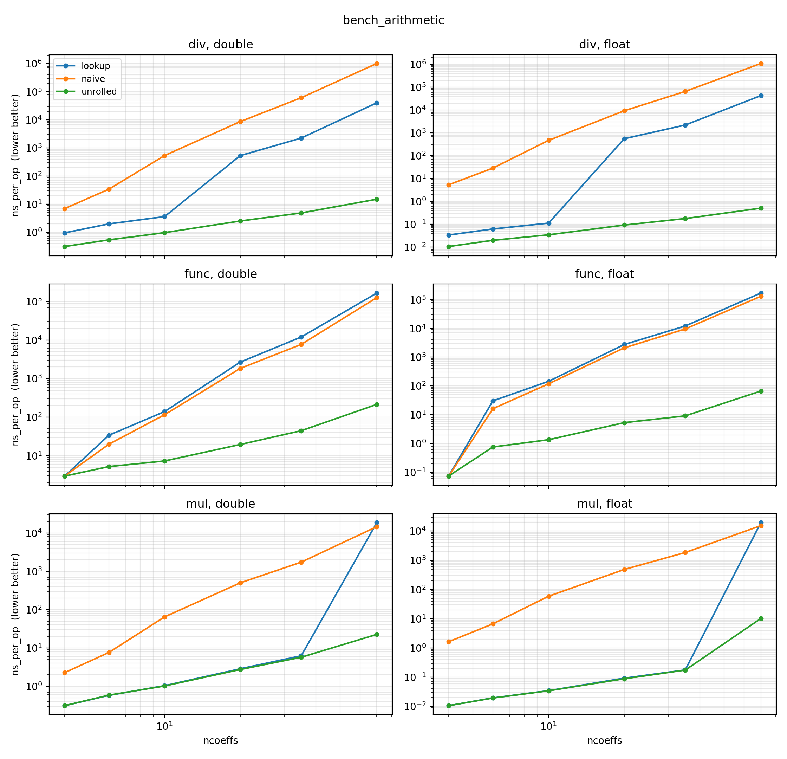
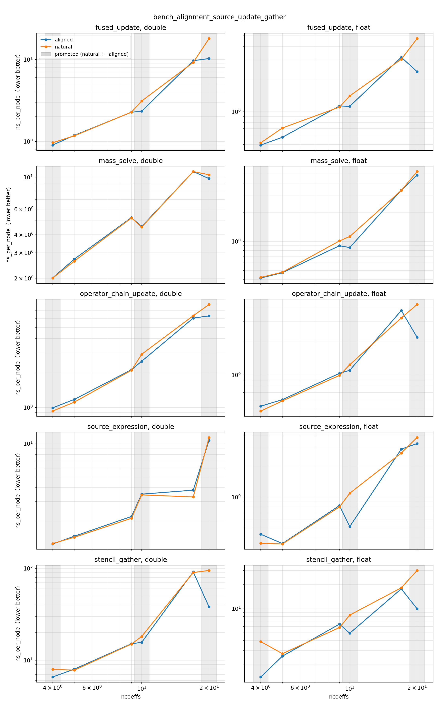
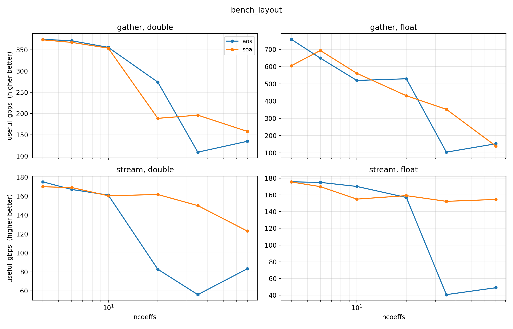
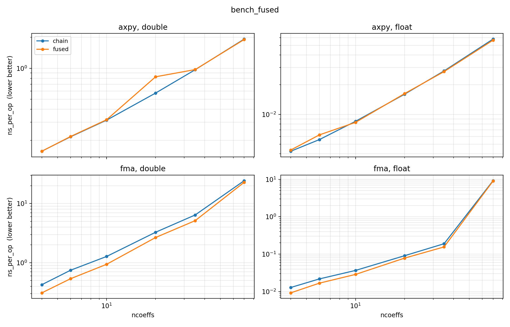

GPU Optimization Benchmark Workflow
===================================

This benchmark suite isolates four GPU optimization questions in the
library:

* arithmetic path: naive coefficient convolution, runtime lookup tables, and
  compile-time unrolled product folds;
* coefficient alignment: natural coefficient alignment versus the library's
  conditional 8- or 16-byte alignment, measured on the real-``otinum`` kernels
  of an explicit finite-element PDE step (source/load eval, operator apply,
  nodal update, and mass solve);
* memory layout: array-of-structs ``Kokkos::View<otinum*>`` versus
  coefficient-major ``oti::soa_span``;
* fused operations: operator chains versus ``axpy`` and ``fma_into`` helpers.

The benchmarks live in ``benchmarks/`` and all write the same tidy CSV schema:

.. code-block:: text

   backend,coeff_type,M,N,ncoeffs,nproducts,kernel,variant,repetition,metric,value,checksum

The shared schema keeps collection and plotting simple. ``checksum`` records a
coefficient sum so that variants expected to compute the same result can be
checked before interpreting timings.

Benchmark Programs
------------------

``bench_arithmetic``
   Question: if all data is already register-resident, how much work is saved
   by replacing runtime multi-index reconstruction with product tables and
   compile-time unrolling?

   It measures multiplication, division, and elementary-function composition. It
   is built as three binaries because the arithmetic implementation is selected
   by ``OTI_BENCHMARK_ARITHMETIC_PATH``: ``naive``, ``lookup``, and
   ``unrolled``.

``bench_alignment_source_update_gather``
   Question: does the library's conditional ``otinum`` alignment make the real
   kernels of an explicit finite-element PDE step faster?

   It compiles real ``oti::otinum`` kernels twice -- once with natural alignment
   and once with the library alignment rule -- and runs them on a representative
   ``68,921``-node working set (the 41x41x41 grid of the companion heat
   problem). It separates the load-vector source expression, the matrix-free
   operator apply (a stencil gather), the nodal update, and the consistent-mass
   solve, so the alignment effect can be read per kernel and compared against the
   end-to-end heat stage. The signal is
   in by-value OTI parameters, temporaries, and the generated-code/coalescing
   behavior of scattered jet loads.

``bench_layout``
   Question: for the same arithmetic and access pattern, should a kernel store
   OTI values as array-of-structs or coefficient-major structure-of-arrays?

   It compares AoS and SoA storage for both streaming and gather access
   patterns. Alignment is not the variant axis here. The gather case is
   important because scattered stencil-like reads can favor one contiguous jet
   load per neighbor over coefficient-major access.

``bench_fused``
   Question: if arithmetic tables, alignment, and layout are fixed, how much
   temporary ``otinum`` traffic is removed by using explicit fused helpers?

   It compares expression-template-style operator chains with explicit fused
   helpers for ``axpy`` and multiply-accumulate patterns.

Build And Run On CUDA
---------------------

Configure the library with Kokkos and the benchmark targets enabled, as shown in
:ref:`benchmarks-before-you-start`. Then collect the benchmark CSVs:

.. code-block:: console

   python3 benchmarks/run_benchmarks.py \
     --build \
     --build-dir build-cuda \
     --output benchmarks/results

The runner expects CUDA output by default and records the GPU, driver, git
revision, and output filenames in ``benchmarks/results/metadata.json``.

Plot The Results
----------------

The generic plotter renders any one CSV or a directory of ``bench_*.csv`` files:

.. code-block:: console

   python3 benchmarks/plot_benchmark.py benchmarks/results

The validation run shown below was collected on an NVIDIA GeForce GTX 1650 with
``--runs 5`` of 11 repetitions each -- 55 pooled samples per configuration, of
which the plotter takes the median -- so that run-to-run variance (cold start,
GPU clock state) is smoothed out, not just back-to-back jitter.

Arithmetic
----------

``bench_arithmetic`` compares the naive implementation against lookup-table and
compile-time-unrolled paths for multiplication, division, and scalar-function
composition.

The algebra operation behind multiplication is a truncated convolution over
multi-indices:

.. code-block:: text

   out[alpha + beta] += lhs[alpha] * rhs[beta], when |alpha + beta| <= N

For example, ``otinum<2,2>`` stores six coefficients:

.. code-block:: text

   c00, c10, c01, c20, c11, c02

corresponding to
``1, e0, e1, e0^2, e0 e1, e1^2``. Multiplication has 15 valid product
contributions, even though the dense coefficient pair space has ``6 * 6 = 36``
pairs:

.. code-block:: text

   out00 = a00*b00
   out10 = a10*b00 + a00*b10
   out01 = a01*b00 + a00*b01
   out20 = a20*b00 + a10*b10 + a00*b20
   out11 = a11*b00 + a10*b01 + a01*b10 + a00*b11
   out02 = a02*b00 + a01*b01 + a00*b02

The product tables are generated for each fixed algebra shape
``otinum<M,N>`` at compile time. They store only valid flat-index triples
``(lhs, rhs, out)`` for the truncated algebra. For ``otinum<2,2>``, that means
the table has exactly 15 entries. The benchmark is therefore not measuring the
cost of building this table inside the GPU kernel; it is measuring whether the
kernel reconstructs the same information repeatedly, walks a precomputed table
at runtime, or expands that table into compile-time coefficient accesses.

The three arithmetic variants differ only in how they find and execute those
contributions:

``naive``
   Loops over coefficient pairs, reconstructs the dense multi-indices
   ``alpha`` and ``beta``, checks whether the output order is still within the
   truncation limit, forms ``gamma = alpha + beta``, and calls ``rank(gamma)``
   to recover the flat output coefficient index. This is the direct
   implementation one would usually write first, but it spends much of the
   kernel doing integer index reconstruction rather than floating-point work.

   Continuing the ``otinum<2,2>`` example, the naive multiply visits all 36
   input pairs. For each flat coefficient index it first rebuilds the
   two-variable exponent vector:

   .. code-block:: text

      index 0 -> alpha = (0,0)  coefficient c00
      index 1 -> alpha = (1,0)  coefficient c10
      index 2 -> alpha = (0,1)  coefficient c01
      index 3 -> alpha = (2,0)  coefficient c20
      index 4 -> alpha = (1,1)  coefficient c11
      index 5 -> alpha = (0,2)  coefficient c02

   A useful product such as ``a10 * b01`` is discovered at runtime:

   .. code-block:: text

      alpha = (1,0), beta = (0,1)
      gamma = alpha + beta = (1,1)
      rank(gamma) = 4
      out[4] += a[1] * b[2]      # out11 += a10 * b01

   A discarded pair still pays most of the same integer-index cost before it
   can be rejected:

   .. code-block:: text

      alpha = (2,0), beta = (1,0)
      gamma = (3,0), |gamma| = 3 > N
      discard this contribution

   So for ``otinum<2,2>`` the naive path performs 36 pair visits to keep 15
   products. Larger algebras make this gap more expensive because each kept
   term still requires rebuilding ``gamma`` and ranking it back into the flat
   coefficient layout.

``lookup``
   Replaces that reconstruction with the precomputed product table. For
   ``otinum<2,2>``, the runtime loop walks the existing 15 ``(lhs, rhs, out)``
   entries directly. Division and inverse use the same idea with a table grouped
   by output coefficient, so each solved coefficient sees only the product terms
   that can contribute to it.

   In the same ``otinum<2,2>`` layout, the multiplication table can be read as
   precomputed flat-index triples:

   .. code-block:: text

      # coefficient indices:
      # 0=c00, 1=c10, 2=c01, 3=c20, 4=c11, 5=c02

      (0,0 -> 0)                         # out00 += a00*b00

      (1,0 -> 1), (0,1 -> 1)             # out10 += a10*b00 + a00*b10
      (2,0 -> 2), (0,2 -> 2)             # out01 += a01*b00 + a00*b01

      (3,0 -> 3), (1,1 -> 3), (0,3 -> 3)
      (4,0 -> 4), (1,2 -> 4), (2,1 -> 4), (0,4 -> 4)
      (5,0 -> 5), (2,2 -> 5), (0,5 -> 5)

   The runtime loop is then just:

   .. code-block:: text

      for (lhs, rhs, out) in product_table:
          c[out] += a[lhs] * b[rhs]

   The table has no invalid entries, so the discarded ``(3,1)`` example from
   the naive path never appears. The kernel still has a runtime loop and runtime
   table loads, but it no longer rebuilds exponent vectors or calls
   ``rank(gamma)`` for every product.

``unrolled``
   Uses the same product tables, but as compile-time indices in a parameter
   pack. The compiler sees literal coefficient offsets and can emit a
   straight-line sequence of loads and fused multiply-adds instead of a runtime
   loop over table entries. This can be faster, especially in division and
   scalar-function composition, but it also increases generated code size and
   can be close to the lookup path for very small algebras.

   Mechanically, this is selected by the benchmark compile definition
   ``OTI_BENCHMARK_ARITHMETIC_PATH=2``. That is not a compiler optimization flag
   like ``-O3``; it chooses a different implementation branch in the library
   headers. The benchmark CMake builds three arithmetic binaries from the same
   source file:

   .. code-block:: text

      OTI_BENCHMARK_ARITHMETIC_PATH=0  -> naive
      OTI_BENCHMARK_ARITHMETIC_PATH=1  -> lookup
      OTI_BENCHMARK_ARITHMETIC_PATH=2  -> unrolled

   In the unrolled branch, ``std::make_index_sequence<nproducts>`` creates the
   compile-time indices ``P...`` and the multiplication loop becomes a fold
   expression over ``product_terms[P]``. Normal library builds use this current
   path by default.

   The difference from ``lookup`` is that the table position is no longer a
   runtime variable. Conceptually, the lookup path is:

   .. code-block:: text

      for p in 0..14:
          term = product_table[p]
          c[term.out] += a[term.lhs] * b[term.rhs]

   The unrolled path instead instantiates the product positions at compile
   time:

   .. code-block:: text

      c[product_table[0].out]  += a[product_table[0].lhs]  * b[product_table[0].rhs]
      c[product_table[1].out]  += a[product_table[1].lhs]  * b[product_table[1].rhs]
      ...
      c[product_table[14].out] += a[product_table[14].lhs] * b[product_table[14].rhs]

   For ``otinum<2,2>``, those table entries are compile-time constants, so the
   compiler can reduce that to ordinary coefficient accesses such as:

   .. code-block:: text

      c[0] += a[0] * b[0]
      c[1] += a[1] * b[0]
      c[1] += a[0] * b[1]
      ...
      c[5] += a[0] * b[5]

   That is why this path is called "unrolled": the library still uses the same
   product table, but the loop over table entries has been moved into template
   instantiation time.

Division uses the same table structure, but the most important part is the
inverse solve. The operator ``a / b`` is evaluated as ``a * inv(b)``. To compute
``y = inv(b)``, the library solves ``b * y = 1`` one coefficient at a time. For
``otinum<2,2>``, the real coefficient is:

.. code-block:: text

   y00 = 1 / b00

Every non-real output coefficient of ``b * y`` must be zero. Because the
coefficient layout is ordered by total degree, lower-order coefficients of
``y`` are already known when a higher-order coefficient is solved:

.. code-block:: text

   b00*y10 + b10*y00 = 0
   y10 = -(b10*y00) / b00

   b00*y01 + b01*y00 = 0
   y01 = -(b01*y00) / b00

   b00*y20 + b10*y10 + b20*y00 = 0
   y20 = -(b10*y10 + b20*y00) / b00

   b00*y11 + b10*y01 + b01*y10 + b11*y00 = 0
   y11 = -(b10*y01 + b01*y10 + b11*y00) / b00

   b00*y02 + b01*y01 + b02*y00 = 0
   y02 = -(b01*y01 + b02*y00) / b00

The naive inverse path rediscovers those contributing terms by scanning
coefficient pairs and ranking ``alpha + beta`` for every solved coefficient.
The lookup path uses a second precomputed table grouped by output coefficient.
For the ``y11`` solve, that grouped table contains exactly the product terms
that contribute to coefficient ``c11``:

.. code-block:: text

   (4,0 -> 4)   # b11*y00
   (1,2 -> 4)   # b10*y01
   (2,1 -> 4)   # b01*y10
   (0,4 -> 4)   # b00*y11, the unknown term

The inverse solver skips the unknown ``b00*y11`` term, accumulates the three
known terms, and divides by ``b00``. The unrolled division path applies the same
idea with compile-time positions in that grouped table.

On the GTX 1650 run shown above, ``otinum<2,2,double>`` multiplication dropped
from about ``7.64 ns/op`` in the naive path to ``0.58 ns/op`` with lookup tables
and ``0.59 ns/op`` with unrolling. Division shows the larger benefit of the
by-output and unrolled paths: about ``34.3 ns/op`` naive, ``2.00 ns/op``
lookup, and ``0.54 ns/op`` unrolled. Function composition is more mixed for the
runtime lookup path at this small size (slower than naive here), but the
unrolled path still reduces the median from about ``19.9 ns/op`` to
``5.25 ns/op``.

Alignment
---------

The alignment question is best asked in applied form: does the library's
conditional ``otinum`` alignment make a real PDE solve faster?
``bench_alignment_source_update_gather`` answers it directly. Instead of a
synthetic memory stream, it runs the kernels that dominate an explicit
finite-element PDE step, on a representative working set of ``68,921`` nodes
(the ``41x41x41`` grid of the companion heat problem), using the real
``oti::otinum`` type so that by-value parameters and temporaries exercise the
generated CUDA register pressure. The metric is ``ns_per_node``, so lower is
better.

The benchmarked operations are the natural FE kernels of an explicit PDE time
step in which every nodal value carries an OTI jet. Each kernel is a Kokkos
``parallel_for`` over the nodes, shown below as a ``KOKKOS_LAMBDA`` (the
benchmark itself uses equivalent functors). Throughout, ``i`` is the node
index, ``T`` is ``oti::otinum<M, N, Coeff>``, the fields ``u``, ``f``, ``Ku``
are ``Kokkos::View<T*>``, and ``mass`` is the scalar lumped mass
``Kokkos::View<Coeff*>``.

``source_expression``
   Load-vector / source-term evaluation: a pointwise closed-form source with OTI
   ``amplitude`` and ``sigma``, evaluated at the node coordinates.

   .. code-block:: cpp

      Kokkos::parallel_for("source", n_nodes, KOKKOS_LAMBDA(int i) {
          Real r2 = x * x + y * y + z * z;             // node coordinates
          T exponent = T(-r2) * inv_two_sigma2;        // inv_two_sigma2 = 1/(2*sigma^2)
          f(i) = amplitude * oti::exp(exponent) * mass(i);
      });

``stencil_gather``
   Matrix-free operator application ``Ku = K u`` over an 8x8 element stencil.
   Each thread reads many scattered neighbor jets and scales them by scalar
   stiffness weights, so this is the gather-bound kernel where aligned wide loads
   matter most.

   .. code-block:: cpp

      Kokkos::parallel_for("operator_apply", n_nodes, KOKKOS_LAMBDA(int i) {
          T sum = T(0);
          for (int elem = 0; elem < 8; ++elem)
              for (int col = 0; col < 8; ++col)
                  sum += K(elem * 8 + col) * u(neighbor(i, elem, col));  // scalar * jet
          Ku(i) = sum;
      });

``operator_chain_update``
   The nodal time update ``u_new = u + dt * M^-1 * (f - alpha * Ku)``, written as
   a plain operator-chain expression (the form the heat application uses). How
   much the fused ``fma_into`` / ``scale_add`` helpers change this update is a
   separate optimization, measured under the fixed-alignment ``bench_fused``
   below; here the only axis is alignment.

   .. code-block:: cpp

      Kokkos::parallel_for("update", n_nodes, KOKKOS_LAMBDA(int i) {
          u_new(i) = u(i) + T(dt) * (Real(1) / mass(i)) * (f(i) - alpha * Ku(i));
      });

``mass_solve``
   Consistent-mass solve ``u_new = M^-1 f`` where the nodal mass ``m`` is itself
   an ``otinum`` (it carries sensitivity), so the per-node cost is dominated by
   ``otinum`` division (inverse plus multiply). This is where any alignment
   effect on the divide path would surface.

   .. code-block:: cpp

      Kokkos::parallel_for("mass_solve", n_nodes, KOKKOS_LAMBDA(int i) {
          u_new(i) = f(i) / m(i);                      // m is Kokkos::View<T*>
      });

The benchmark is built as two binaries because the real ``otinum`` alignment is
selected in the library headers:

.. code-block:: text

   bench_alignment_source_update_gather_natural  -> OTI_BENCHMARK_NATURAL_ALIGNMENT
   bench_alignment_source_update_gather_aligned  -> default library alignment

Both variants compute the same result -- the per-kernel checksums match across
natural and aligned -- so any timing difference is purely the alignment rule and
not a change in the math.

An ``otinum<M,N,Coeff>`` stores its coefficients contiguously in the object.
Alignment controls the address boundary where each object starts in memory. The
ordinary C++ layout for a coefficient array is naturally aligned to
``alignof(Coeff)``: typically 4 bytes for ``float`` and 8 bytes for ``double``.
The optimized library layout conditionally promotes the object alignment to 8
or 16 bytes when that can be done without changing ``sizeof(otinum)``.

Mechanically, this is done on the ``otinum`` type itself:

.. code-block:: cpp

   template <int M, int N, class Coeff>
   class alignas(detail::otinum_alignment<
       Coeff, detail::tables<M, N>::ncoeffs>()) otinum {
       Coeff c_[detail::tables<M, N>::ncoeffs];
   };

The helper sees only the coefficient type and coefficient count, and applies a
deliberately conservative rule:

.. code-block:: text

   bytes = ncoeffs * sizeof(Coeff)

   if bytes is a multiple of 16: align to 16 bytes
   else if bytes is a multiple of 8: align to at least 8 bytes
   else: keep natural coefficient alignment

The ``bytes`` test is what keeps the object size unchanged. C++ object sizes
must be multiples of their alignment. If a 32-byte object is promoted from
8-byte to 16-byte alignment, ``sizeof`` is already valid because ``32 % 16 ==
0``. If a 24-byte float object is promoted from 4-byte to 8-byte alignment,
``24 % 8 == 0``. But a 20-byte float object cannot be promoted to 8 or 16
without adding tail padding, so it keeps natural alignment. In an array, this
also means every element remains correctly aligned: the first object starts on
the requested boundary, and each next object is exactly ``sizeof(otinum)`` bytes
later, still on that boundary.

The reason to do this is that the compiler and GPU memory path can treat the
coefficient block as starting on a natural vector-load boundary. A four-float
``otinum<3,1,float>`` is 16 bytes; when the type is 16-byte aligned, loading or
storing that object can map cleanly to 128-bit operations instead of a sequence
of smaller or potentially misaligned accesses. The same idea applies at 8 bytes
for shapes that cannot reach a 16-byte boundary without padding.

There is no padding step in this rule. Near-miss sizes are not rounded up to the
next alignment boundary. That matters for arrays of structs: padding every OTI
number can improve individual loads in some cases, but it also increases memory
traffic and can reduce useful bandwidth.

For the shapes this benchmark sweeps:

.. code-block:: text

   otinum<3,1,double>:  ncoeffs=4,  bytes=32   natural=8, aligned=16  (promoted)
   otinum<3,1,float>:   ncoeffs=4,  bytes=16   natural=4, aligned=16  (promoted)

   otinum<4,1,double>:  ncoeffs=5,  bytes=40   natural=8, aligned=8   (unchanged)
   otinum<4,1,float>:   ncoeffs=5,  bytes=20   natural=4, aligned=4   (unchanged)

   otinum<8,1,double>:  ncoeffs=9,  bytes=72   natural=8, aligned=8   (unchanged)
   otinum<8,1,float>:   ncoeffs=9,  bytes=36   natural=4, aligned=4   (unchanged)

   otinum<16,1,double>: ncoeffs=17, bytes=136  natural=8, aligned=8   (unchanged)
   otinum<16,1,float>:  ncoeffs=17, bytes=68   natural=4, aligned=4   (unchanged)

   otinum<3,2,double>:  ncoeffs=10, bytes=80   natural=8, aligned=16  (promoted)
   otinum<3,2,float>:   ncoeffs=10, bytes=40   natural=4, aligned=8   (promoted)

   otinum<3,3,double>:  ncoeffs=20, bytes=160  natural=8, aligned=16  (promoted)
   otinum<3,3,float>:   ncoeffs=20, bytes=80   natural=4, aligned=16  (promoted)

The ``(unchanged)`` shapes are the rule's own control group: for ``<4,1>``,
``<8,1>``, and ``<16,1>`` the byte count is not a multiple the rule can promote,
so the natural and aligned binaries compile to identical layout. Any timing
difference on those shapes is run-to-run noise, not alignment -- a useful sanity
check when reading the plot. The plot shades the promoted ``ncoeffs`` columns
(those whose byte count reaches an 8- or 16-byte boundary, i.e. even
``ncoeffs``) so the control shapes stand out as the unshaded columns where the
natural and aligned lines should coincide.

Alignment is a memory-layout optimization, not an arithmetic one: it does not
change the number of product terms, the number of coefficients, or the
mathematical result. It only changes how friendly the array element address is
to the backend, so its effect depends entirely on how a kernel touches memory.

The GTX 1650 results bear that out kernel by kernel. The clear, repeatable
signal is in the gather-bound operator apply, largest for the big jets and for
the shapes promoted to a full 16-byte boundary (the ``float`` ``<3,1>`` and
``<3,3>`` jets, which are exact 16-byte multiples):

.. code-block:: text

   stencil_gather, natural -> aligned ns_per_node (lower is better):
     <3,1> double   7.30 ->  6.23  (1.17x)    float   3.70 ->  1.46  (2.53x)
     <3,2> double  16.89 -> 15.53  (1.09x)    float   7.70 ->  4.81  (1.60x)
     <3,3> double  83.34 -> 40.90  (2.04x)    float  27.72 ->  9.72  (2.85x)

This is exactly where alignment should help: each thread issues many scattered
neighbor-jet loads, so promoting the jet to a 16-byte boundary lets the backend
coalesce them into wide 128-bit transactions. The pointwise kernels move far
less memory per node and stay correspondingly closer to neutral. The nodal
update picks up a more modest gather-like benefit at the largest jet
(``operator_chain_update`` at ``<3,3>`` is ``1.19x`` for double and ``1.98x``
for float), while ``source_expression`` and ``mass_solve`` stay within noise of
``1.00x`` except at the largest jets. As predicted by the shape table, the ``<4,1>``,
``<8,1>``, and ``<16,1>`` control shapes show only sub-pattern jitter, because
natural and aligned compile to identical layout there.

These standalone numbers also explain the heat-application alignment stage. In
the archived heat optimization run, the ``otinum<3,1>`` alignment stage (the
``unrolled`` to ``aligned`` transition, both variants still using the
operator-chain expressions) measured about ``1.84x`` for float and ``1.02x`` to
``1.12x`` for double. That is the same mechanism isolated here: the float
``<3,1>`` stencil gather alone is ``2.53x``, and the stiffness gather is the
memory-bound part of the heat step, so the application-level float speedup is
dominated by exactly the kernel this benchmark separates out. Read each kernel
on its own and compare it against the end-to-end stage; this benchmark is the
generated-code and coalescing diagnostic, not a replacement for the full solve.

To inspect the register-pressure side directly, build the CUDA targets and run:

.. code-block:: console

   cuobjdump --dump-resource-usage \
     build-cuda/benchmarks/bench_alignment_source_update_gather_aligned | c++filt

Compare that with ``bench_alignment_source_update_gather_natural`` and look for
the ``source_expression_kernel``, ``operator_chain_update_kernel``,
``stencil_gather_kernel``, and ``mass_solve_kernel`` functors.

Layout
------

``bench_layout`` asks, for the same arithmetic, whether OTI values should be
stored as an array-of-structs (``Kokkos::View<otinum*>``, each jet contiguous)
or coefficient-major as ``oti::soa_span`` (all coefficient-0 values, then all
coefficient-1 values, and so on). One templated kernel drives both layouts
through a common ``load``/``store`` surface, so only the storage changes. The
metric is useful GB/s (useful coefficient bytes moved divided by time), higher
is better, and both layouts compute the same result. It measures two access
patterns:

``stream``
   A contiguous ``y = a*x + y`` over the jets -- the pure-coalescing question.

   .. code-block:: cpp

      Kokkos::parallel_for("stream", n, KOKKOS_LAMBDA(int i) {
          T xi = x.load(i);                            // load = AoS or SoA
          T yi = y.load(i);
          for (int k = 0; k < T::ncoeffs; ++k)
              yi[k] = a * xi[k] + yi[k];
          y.store(i, yi);
      });

``gather``
   Each element sums 8 neighbor jets at scattered offsets, like a stencil
   matvec. AoS reads each neighbor as one contiguous (possibly wide) jet; SoA
   reads it as ``ncoeffs`` coalesced loads.

   .. code-block:: cpp

      Kokkos::parallel_for("gather", n, KOKKOS_LAMBDA(int i) {
          T acc{};
          for (int j = 0; j < 8; ++j) {
              T nb = x.load((i + neighbor_offset(j)) % n);
              for (int k = 0; k < T::ncoeffs; ++k)
                  acc[k] += nb[k];
          }
          y.store(i, acc);
      });

This is access-pattern guidance, not a universal rule. For small jets the two
layouts are within noise in both patterns (``<3,1>`` and ``<2,2>`` sit at about
``1.00x``). The decisive case is the large jet, where AoS coalescing collapses
but SoA stays coalesced: streaming ``<4,3,float>`` is about ``4.2x`` faster as
SoA (``38 -> 158`` useful GB/s) and ``<4,3,double>`` about ``2.6x``; the gather
shows the same at large jets (``<4,3,float>`` about ``4.1x``). But small and
medium gathers favor AoS, because each neighbor is a single contiguous jet load:
``<3,1,float>`` gather is about ``1.2x`` faster as AoS. That is exactly the shape
and access pattern of the heat solver's stiffness gather, which is why the heat
production layout stays AoS even though the streaming advice for large jets is
SoA.

Fused Operations
----------------

``bench_fused`` isolates the fused accumulation helpers against the equivalent
operator chains, on a compute-bound, register-resident kernel (arithmetic,
alignment, and layout all held fixed). Both forms compute the same value; the
fused form avoids the intermediate ``otinum`` temporaries the operator chain
materializes. The metric is ``ns_per_op``, lower is better, and the variant
axis is ``chain`` vs ``fused`` over two patterns:

``axpy``
   ``t = a*x + t``  versus  ``oti::axpy(t, a, x)`` (``a`` a scalar).

``fma``
   ``t = t + x*y``  versus  ``oti::fma_into(t, x, y)`` (``x``, ``y`` both jets).

``axpy`` is essentially neutral everywhere (about ``1.00x``): a scalar-times-jet
plus a jet leaves little temporary traffic to remove. The multiply-accumulate
``fma`` is where fusing pays, because ``fma_into`` eliminates the ``x*y`` product
temporary: on the GTX 1650 it is about ``1.40x`` faster at ``<3,1,double>``,
``1.36x`` at ``<2,2>`` and ``<3,2>``, easing to about ``1.2x`` for the larger
jets and toward neutral by ``<4,4>``, where the per-op arithmetic dwarfs the one
saved temporary. ``float`` follows the same curve. So reach for ``fma_into`` in
repeated multiply-accumulate kernels; ``axpy`` is a readability helper, not a
speedup.

Reading The Plots Together
--------------------------

The arithmetic plot is the main naive-versus-optimized story: lookup tables
remove repeated multi-index reconstruction, and unrolled folds remove the
runtime table walk where the algebra is large enough for that overhead to
matter.

The alignment plot is read kernel by kernel, not as one number.
``bench_alignment_source_update_gather`` runs the real FE kernels of an explicit
PDE step, so the takeaway is that the conditional alignment rule pays off where the
kernel issues scattered jet loads -- the matrix-free operator apply -- and the
benefit is largest for the big jets and the shapes promoted to a full 16-byte
boundary, while the pointwise source, update, and mass-solve kernels stay near
neutral on the promoted shapes. That is why the
float ``<3,1>`` heat-application alignment stage is carried by the stiffness
gather, and why these per-kernel numbers line up with the end-to-end stage
rather than contradicting it.

The layout plot explains why SoA is not automatically faster. Coefficient-major
storage can improve coalescing for streaming larger coefficient arrays, while
small scattered gathers may still prefer AoS because each neighbor is loaded as
one contiguous jet.

The fused-operation plot measures expression shape rather than algebra table
construction. ``fma_into`` is most relevant to repeated multiply-accumulate
kernels, while ``axpy`` is expected to be closer to neutral.

Each of these is one optimization measured in isolation. To see them stacked in
a real, end-to-end solve, see :doc:`heat_equation`.

Running Your Own Investigations
-------------------------------

The suite is meant to be poked at, not just reproduced. Each lever below changes
one thing independently of the others.

* **Run a single benchmark.** Each benchmark is a standalone binary, so you can
  probe one question without the full sweep. The first argument sets the work per
  measurement (its meaning is benchmark-specific) and the second is the
  repetition count:

  .. code-block:: console

     ./build-cuda/benchmarks/bench_layout 20 3              # 20 timed passes, 3 repetitions
     ./build-cuda/benchmarks/bench_fused 16384 11           # 16384 elements, 11 repetitions
     ./build-cuda/benchmarks/bench_alignment_source_update_gather 68921 11  # 68921 nodes, 11 repetitions

  Run a binary with no arguments and it uses a built-in default for each. Some
  also accept further optional arguments (for example a ``target_ms``
  calibration time); the full list is the argument parsing at the top of each
  benchmark's ``main``.

* **Plot a single investigation.** Each benchmark writes its own
  ``bench_<name>.csv``. Pointing the plotter at that one file -- rather than the
  results directory -- plots only that investigation:

  .. code-block:: console

     python3 benchmarks/plot_benchmark.py benchmarks/results/bench_layout.csv

* **Pool more samples.** Repetitions run back-to-back in one process (default 11)
  and smooth out jitter, but not run-to-run effects like cold start or GPU clock
  state. To smooth those, run the whole suite ``N`` times with
  ``run_benchmarks.py --runs N``; the plotter then takes the median over all
  ``N * repetitions`` samples.

* **Change the plot axis.** ``plot_benchmark.py`` plots against ``ncoeffs`` by
  default. Pass ``--x M`` or ``--x nproducts`` to re-read an existing CSV against
  a different size axis -- no need to re-run the benchmark.

* **Add a CPU column.** Build against a Serial/OpenMP Kokkos instead of CUDA and
  run ``run_benchmarks.py --allow-non-cuda`` to collect CPU numbers for any
  benchmark.

* **Sweep new algebra shapes.** The swept ``otinum<M,N>`` shapes are the
  ``run_shape<M,N>`` (or ``run_both``) calls in each benchmark's ``main``. Add a
  line for the shape you care about and rebuild. Compile cost grows quickly at
  large ``M``/``N`` because the inlined-table paths are generated per shape.
