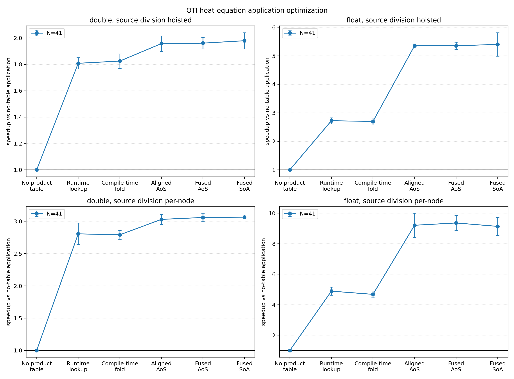
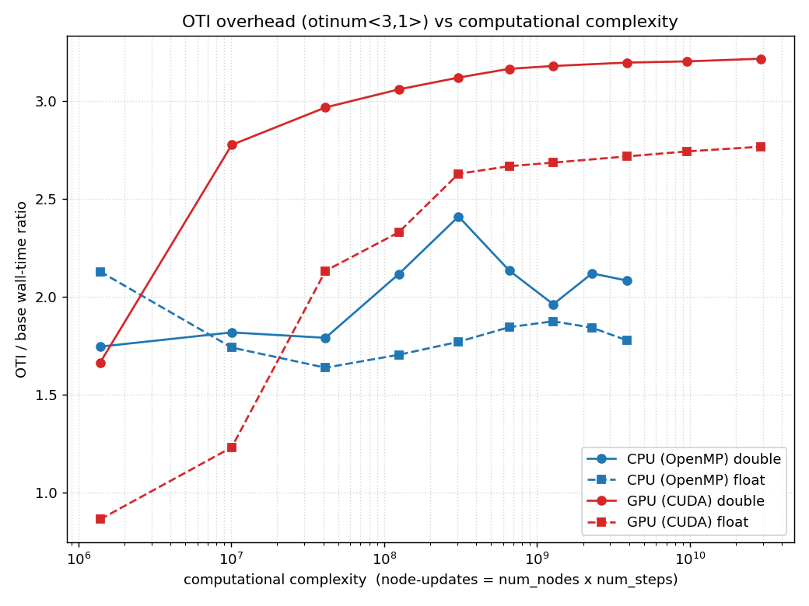
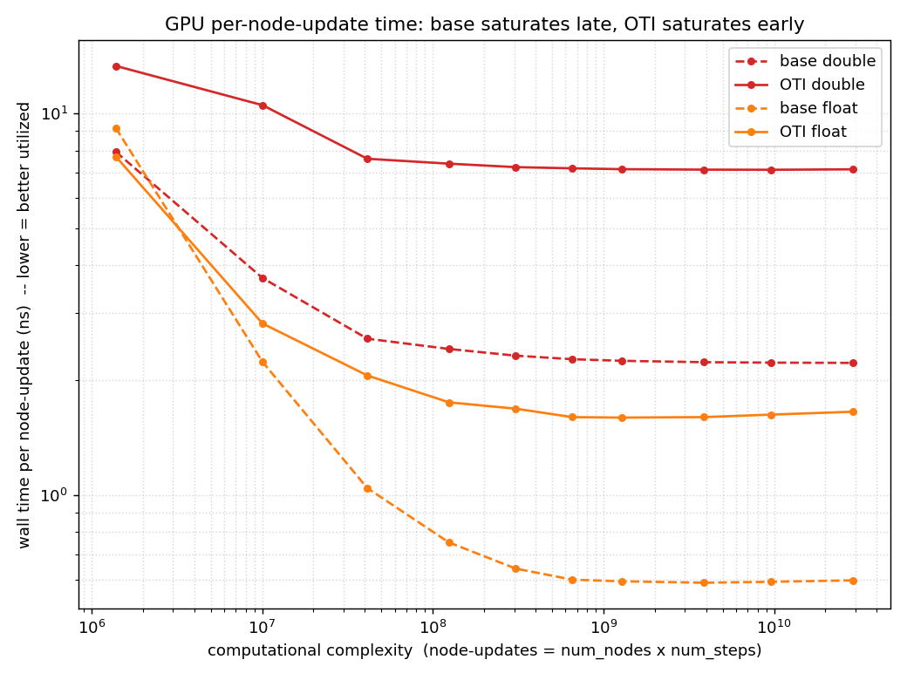

Heat Equation: Optimizations Stacked End-to-End
===============================================

The isolation benchmarks each flip exactly one optimization and hold everything
else fixed. This page is the culmination: a real, end-to-end PDE solve -- a 3D
heat equation with an OTI sensitivity jet at every node -- with the same
optimizations switched on one at a time, so the per-isolation results can be
seen compounding in production.

The solver lives in its own repository, built to exercise ``cpp_oti_lib`` as a
drop-in ``Scalar`` type:

   https://github.com/Samm-Py/heat_equation

It solves the heat equation on the unit cube with a Gaussian source. Every nodal
temperature is an ``oti::otinum`` that carries derivatives with respect to the
source parameters, so a single forward solve also returns the sensitivities. The
study below is the ``N=41`` grid -- ``68,921`` nodes, the same working set the
alignment benchmark uses.

The study runs the solver in two **source-division** modes. In *hoisted* (the
normal solver) the source term's denominator is computed once and lifted out of
the timed loop; in *per-node* -- mathematically equivalent -- the OTI division is
done at every node inside the timed source kernel, so it does more OTI division
work. ``hoisted`` is the realistic case; ``per-node`` stresses OTI division
specifically, which is why it leans harder on the optimizations below.

The stacked optimization stages
-------------------------------

Each stage turns on exactly one of the isolation benchmarks, cumulatively on top
of the previous ones:

.. list-table::
   :header-rows: 1
   :widths: 22 38 40

   * - stage
     - what it turns on
     - isolation benchmark
   * - no product table
     - naive multi-index reconstruction
     - ``bench_arithmetic`` (naive)
   * - runtime lookup
     - precomputed product tables
     - ``bench_arithmetic`` (lookup)
   * - compile-time fold
     - unrolled product tables
     - ``bench_arithmetic`` (unrolled)
   * - aligned
     - conditional ``otinum`` alignment
     - ``bench_alignment_source_update_gather``
   * - fused AoS
     - ``axpy`` / ``fma_into`` helpers
     - ``bench_fused``
   * - fused SoA
     - coefficient-major ``soa_span``
     - ``bench_layout``

End-to-end result
-----------------

On the GTX 1650, stacking the stages speeds up the full OTI heat solve relative
to the no-product-table baseline by about (``N=41``, source term hoisted):

* ``float``: ``2.7x`` at runtime lookup, jumping to ``5.4x`` at the aligned
  stage and holding through the fused stages. The alignment stage is the big
  jump, exactly as the standalone stencil-gather numbers predict.
* ``double``: ``1.8x`` at lookup easing to ``2.0x`` at fused SoA -- a flatter
  curve, because the larger double jets are less memory-bound at this shape.

The per-node source-division variant (more division work per node) leans harder
on the same optimizations and reaches about ``9.2x`` for ``float``.

The more telling number is the OTI solve cost relative to a plain ``double``
base solve that carries no sensitivities. Stacking the optimizations cuts that
overhead from about ``11x`` down to ``1.1x`` for ``float``, and from ``6.6x``
to ``2.9x`` for ``double``. A full-sensitivity ``float`` solve for roughly 10%
over a plain solve is the headline these isolated optimizations add up to.

Two details tie back to the isolation studies:

* The dominant ``float`` speedup arrives at the **aligned** stage, consistent
  with the alignment page: the stiffness gather is the memory-bound kernel, and
  aligning the small ``float`` jets lets its scattered neighbor loads coalesce.
* The **SoA** stage is only marginal here -- and slightly *hurts* the ``float``
  per-node variant -- consistent with the layout page: the stiffness gather is a
  small-jet gather, where AoS wins. So the production heat layout stays AoS; SoA
  is the tool for large-jet streaming, not this solve.

Why the OTI overhead grows with problem size
---------------------------------------------

A natural question is how the OTI solve's overhead scales as the problem grows.
Sweeping grid size and step count -- so the x-axis is total node-updates
(``num_nodes x num_steps``) -- shows the OTI/base wall-time ratio *rising* and
then plateauing, at about ``3.2x`` for double and ``2.8x`` for float on the
GTX 1650:

The intuitive guess is that the overhead grows because the larger OTI jet costs
more memory traffic. The per-node-update decomposition shows the mechanism is
actually the opposite of "OTI gets more expensive": it is the *base* solve being
under-utilized at small sizes. Plotting wall time *per node-update* (lower means
better GPU utilization), every curve falls as the problem grows -- everything is
latency- and launch-bound when the GPU is starved of work -- but the base scalar
solve falls much further than the OTI solve:

* ``float``: the base solve drops from about ``9.2`` to ``0.60`` ns/node-update
  (15x) as it saturates near ``~1e9`` node-updates; the OTI solve drops only
  ``~7.7 -> ~1.6`` ns and flattens by ``~1e8``. At the smallest size the ratio
  is even *below 1* -- the scalar kernel is too small to fill the GPU, while the
  4x-heavier OTI kernel is already closer to saturation.
* ``double``: base ``~7.9 -> ~2.2`` ns (3.6x); OTI ``~13.3 -> ~7.1`` ns (1.9x).

The OTI solve carries four ``otinum<3,1>`` coefficients, so it does roughly 4x
the work per node and saturates the GPU *earlier*; the tiny scalar base solve
needs a much larger problem before it saturates. The ratio climbs because the
base denominator shrinks toward its throughput floor, not because OTI slows
down, and it plateaus once both are saturated -- the regime the existing sweep
already reaches (up to ``N=151``, 3.4M nodes, ``~2.9e10`` node-updates).

The plateau *value* is set by device memory bandwidth, not host-device copies --
the field stays resident on the device across timesteps. A bandwidth-bound kernel
that moves four coefficients where the base moves one lands near a 3-4x ratio once
saturated, dominated by the memory-bound stencil gather that the alignment and
layout studies single out.

.. TODO: the commands below reference benchmarks/ scripts
   (run_heat_optimization_benchmarks.py, run_benchmark.sh, plot_benchmark.py,
   plot_oti_overhead_by_stage.py) that are NOT yet published in the
   Samm-Py/heat_equation repository -- they currently live only in a local
   working area. Either push the benchmark tooling to that repository or
   rewrite this section before pointing readers at it. (Noted 2026-07-04
   during the docs review; decision was to defer.)

Reproducing
-----------

Clone the heat solver beside ``cpp_oti_lib`` (so its headers resolve at
``../include``). Everything here runs on a **CUDA Kokkos** build: configure a
``build-cuda`` directory once with ``nvcc_wrapper`` against a CUDA-enabled Kokkos
install, then build it (the runners verify the ``Cuda`` backend; pass
``--allow-non-cuda`` only to force a Serial/OpenMP build):

.. code-block:: console

   git clone https://github.com/Samm-Py/heat_equation.git
   cd heat_equation

   export NVCC_WRAPPER_DEFAULT_COMPILER=g++-11
   cmake -S . -B build-cuda \
     -DCMAKE_CXX_COMPILER=/path/to/kokkos-cuda-install/bin/nvcc_wrapper \
     -DCMAKE_PREFIX_PATH=/path/to/kokkos-cuda-install
   cmake --build build-cuda --parallel

Building the CUDA Kokkos install itself is covered in
:doc:`../tutorials/kokkos_gpu`; the heat solver's README has the full toolchain
notes.

**Reproduce this page's figures.** The stacked-stage speedup figure comes from
the optimization study (``--build`` adds the cumulative stage binaries); the
overhead-vs-problem-size figures come from the grid-size scaling sweep:

.. code-block:: console

   # stacked-stage speedup figure
   python3 benchmarks/run_heat_optimization_benchmarks.py \
     --build --build-dir build-cuda --grid-sizes 41
   python3 benchmarks/plot_heat_optimization_benchmarks.py \
     benchmarks/results/optimization_study

   # OTI overhead vs problem size (oti_overhead.png, oti_overhead_saturation.png)
   SWEEP_DEVICES=gpu benchmarks/run_benchmark.sh
   python3 benchmarks/plot_benchmark.py

Drop ``SWEEP_DEVICES=gpu`` to also sweep a CPU/OpenMP ``build/`` (the published
overhead figure includes both halves).

**OTI overhead for each optimization increment.** To get the
overhead-vs-problem-size data *per optimization stage*, sweep the optimization
study over several grid sizes and all variants. The stages are cumulative
(``aligned`` already includes the unrolled arithmetic path, ``fused_aos`` is also
aligned, and so on), and ``naive`` must stay in -- it is the speedup and checksum
baseline:

.. code-block:: console

   python3 benchmarks/run_heat_optimization_benchmarks.py \
     --build --build-dir build-cuda \
     --grid-sizes 21 31 41 51 61 81 \
     --variants naive lookup unrolled aligned fused_aos fused_soa \
     --total-time 0.01 --source-divisions hoisted

By default the runner sweeps *both* source-division modes (``hoisted`` and
``per-node``, described at the top of this page), which doubles every run; for the
overhead study pick one with ``--source-divisions`` -- ``hoisted`` is the
representative case.

``--total-time`` is the physical simulation time (default ``0.01``); hold it fixed
across the sweep so the per-grid work (``num_nodes * num_steps``) is set by the
timestep alone as the grid refines. The solver uses a fixed explicit-Euler step
``dt = 0.8 * dx^2 / (6 * alpha)`` -- an ``0.8`` safety factor on the 3D stability
limit, with ``alpha`` the thermal diffusivity (default ``1``, set by ``--alpha``).
Since ``dt`` scales as ``dx^2``, ``num_steps`` grows like ``N^2`` as the grid
refines.

Each row of ``heat_optimization_results.csv`` carries ``oti_over_base`` -- the OTI
solve time over the plain base scalar solve, for that ``(stage, grid size)`` --
which is the per-stage OTI overhead. Plot it against problem size with:

.. code-block:: console

   python3 benchmarks/plot_oti_overhead_by_stage.py \
     benchmarks/results/optimization_study

This writes ``oti_overhead_by_stage.{png,pdf}`` -- one overhead-vs-size curve per
optimization stage (the multi-value ``--grid-sizes`` sweep above gives each curve
more than one point). Pass ``--x num_nodes`` to use node count instead of total
node-updates.

For a single optimization measured *independently* of the cumulative stack, use
the isolation benchmarks in :doc:`gpu_optimization_workflow`. See the heat
solver's own README for the full set of runners and plotting scripts.
