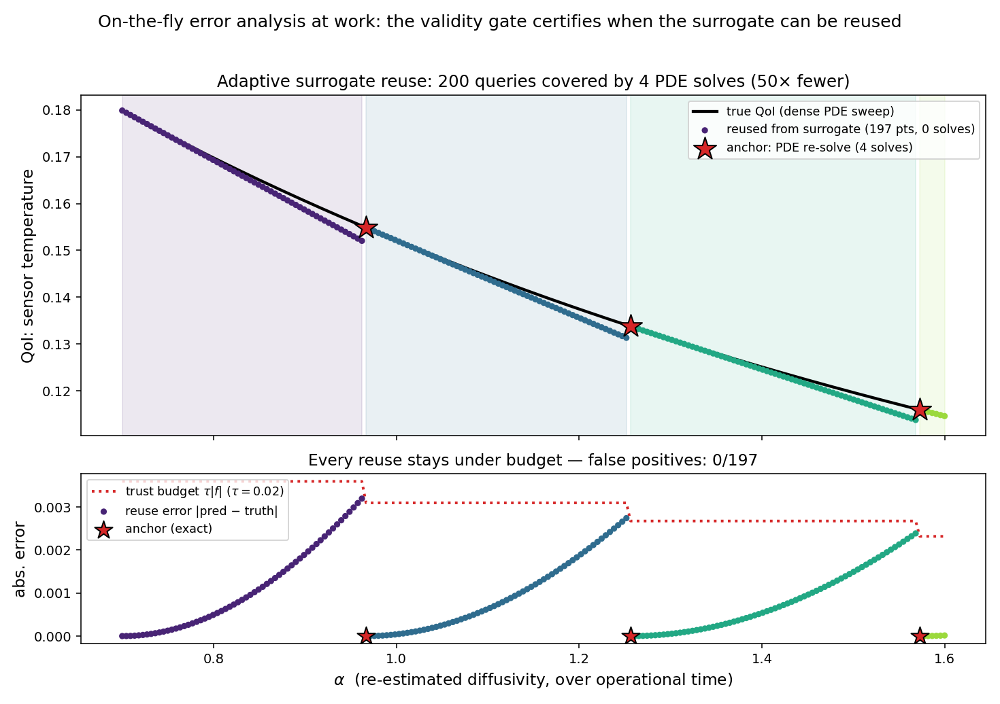

Digital Twin: Certified Surrogate Reuse
=======================================

The :doc:`surrogate` example showed that a jet from one solve predicts the
solution at nearby parameters; it left open *how near is near enough*. This
example closes that loop with the library's validity layer
(:doc:`../tutorials/validity`) and uses it the way a digital twin needs it:
**online, against a drifting parameter, with a certificate on every reused
answer.**

Scenario
--------

The effective diffusivity ``alpha`` of the :doc:`heat_equation` problem is
re-estimated repeatedly over operational time and drifts slowly across
``[0.7, 1.6]`` (aging, fouling, temperature-dependent properties). Each of
**200 updates** needs a fresh quantity of interest -- the final-time
temperature at a fixed sensor location. Re-solving the PDE for every update is
the honest but expensive answer; reusing an old solve blindly is cheap but
uncertified.

The adaptive strategy keeps an **atlas of anchor jets** -- each anchor is one
solve with ``otinum<3, 2>``, whose first-order coefficient is the surrogate
model and whose second-order coefficient feeds the truncation-error
estimate. A certified twin must never re-solve territory it has already
certified, so every anchor is kept forever (a jet is ten doubles), each query
is served by the nearest one, and a new solve happens only when **no** stored
anchor's trusted region covers the query:

.. code-block:: cpp

   namespace val = oti::validity;

   auto k = nearest_anchor(alpha_q);            // nearest stored anchor jet
   h = {alpha_q - atlas_alpha[k], 0.0, 0.0};    // offset per seeded variable
   if (!val::is_trusted(atlas_jet[k], h, tau, /*tau_abs=*/0.0, /*order=*/1)) {
       // nothing certified covers this query: solve once, KEEP the anchor
       k = add_anchor(alpha_q);
       h = {0.0, 0.0, 0.0};
   }
   q = val::evaluate(atlas_jet[k], h, /*order=*/1);   // no solve on reuse

The trailing argument is the certified model order: the reused prediction is
the *linear* model, and the jet's order-2 term is what prices its truncation
error. ``is_trusted`` compares that estimate at offset ``h`` against the
budget ``tau`` -- the same one-order-above machinery described in the validity
tutorial, applied per query at negligible cost.

Results
-------

With ``tau = 0.02``:

* **200 updates are served by 4 PDE solves** -- a 50x reduction in solves.
  The other 196 queries are polynomial evaluations.
* **Every reused answer is certified**: validated against a dense sweep of
  true re-solves (computed only to audit the gate, not part of the method's
  cost), no reuse exceeded its error budget -- **0 false positives out of 197
  gate decisions**.
* The bottom panel shows the mechanism: the reuse error climbs as ``alpha``
  drifts away from the anchor, approaches the ``tau`` budget, the gate trips,
  a re-solve resets the error to zero -- and the cycle repeats. The solve
  count is not scheduled; it *emerges* from the drift rate and the tolerance.

Tightening ``tau`` buys accuracy with more re-solves; loosening it buys
economy -- the trade is explicit and always certified, which is the property a
digital twin needs to run unattended: recompute only when the estimate drifts
out of the trusted region, and *know* that is the criterion being enforced.

Sources
-------

``uq_adaptive_reuse.cpp`` (the sweep, the gate, the audit against dense truth)
and ``plot_adaptive_reuse.py`` (the figure), on the
`oti-analysis-and-benchmarks branch
<https://github.com/Samm-Py/heat_equation/tree/oti-analysis-and-benchmarks>`_
of the heat-equation fork. The validity machinery itself -- ``is_trusted``,
``evaluate``, ``truncation_error``, ``validity_radius`` -- is part of the
library: see :doc:`../tutorials/validity`.

The atlas also makes returning cheap: a query inside *any* stored anchor's
trusted region costs nothing, no matter how long ago that anchor was solved.
:doc:`digital_twin_gp` takes the same jets one step further -- fusing all
anchors into a single global Gaussian-process surrogate over all three
parameters -- and quantifies what each derivative order is worth in PDE
solves.
