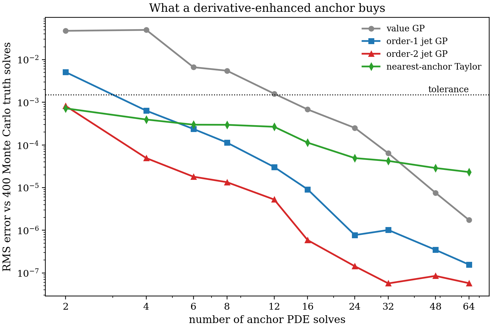
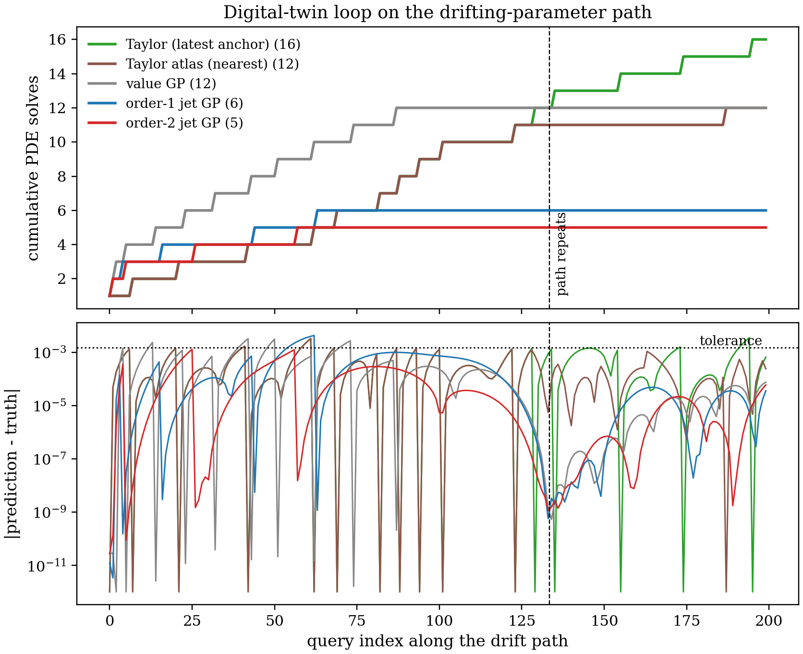

Digital Twin II: A Gaussian-Process Twin From Jets
==================================================

The :doc:`digital_twin` page has a deliberate weakness: its Taylor anchor is
**memoryless**. Every re-solve discards all previous anchors, the surrogate
only ever extrapolates from the *latest* one, and when the drifting parameter
wanders back through territory it has already visited, the twin re-solves
anyway. This page replaces the single-anchor Taylor surrogate with a
**derivative-enhanced Gaussian process** trained on the jets themselves, using
`JetGP <https://github.com/Samm-Py/jetgp>`_ (`documentation
<https://samm-py.github.io/jetgp/>`_) -- and works in all **three** parameters
at once: the GP is a global surrogate of the sensor QoI over the
``(alpha, A, sigma)`` box.

Jets Are Training Data
----------------------

One ``otinum<3, 2>`` solve returns the QoI's value, gradient, and full Hessian
(mixed partials included) with respect to the three parameters -- **10 exact
observations from one PDE solve**, with none of the step-size noise that
finite-difference derivatives would inject into a GP's covariance structure.
JetGP's ``DEGP`` module consumes exactly this: coordinate-aligned partial
derivatives of arbitrary order, declared as derivative multi-indices:

.. code-block:: python

   from jetgp.full_degp.degp import degp

   # one entry per observed derivative: [variable, order] factors
   der_indices = [
       [[[1, 1]], [[2, 1]], [[3, 1]]],                    # gradient
       [[[1, 2]], [[1, 1], [2, 1]], [[1, 1], [3, 1]],     # Hessian,
        [[2, 2]], [[2, 1], [3, 1]], [[3, 2]]],            # mixed included
   ]
   model = degp(X_anchors, [q, dq_da, dq_dA, dq_ds, ...],
                n_order=2, n_bases=3, der_indices=der_indices,
                derivative_locations=locations, kernel="SE",
                kernel_type="anisotropic")

Because the order-2 jet contains the order-1 jet, a single exported anchor
bank serves every variant below -- the comparison isolates the *information
content per solve*, nothing else.

What A Derivative-Enhanced Anchor Buys
--------------------------------------

Four surrogates are trained on the **same** nested Halton sequence of anchor
points in the box and measured against **400 Monte Carlo truth solves**
(genuine PDE re-solves at random parameter points -- affordable here, which is
exactly what makes the claim auditable):

.. list-table:: Anchor PDE solves needed to reach the tolerance (1.5e-3, ~1% of the nominal QoI)
   :header-rows: 1
   :widths: 40 20 40

   * - Surrogate
     - Solves
     - Observations per solve
   * - value-only GP
     - 16
     - 1
   * - order-1 jet GP
     - 4
     - 4 (value + gradient)
   * - order-2 jet GP
     - **2**
     - 10 (+ full Hessian)
   * - nearest-anchor Taylor
     - 2
     - 10, used locally

That table is what "the derivatives buy you," in units everyone accepts: PDE
solves. Three structural readings from the curves:

* **The jet advantage is largest exactly where it matters** -- at low anchor
  counts, the expensive-simulation regime. At 2 anchors the order-2 jet GP is
  already 58x more accurate than the value-only GP; at 16 anchors it is three
  orders of magnitude ahead.
* **Local vs global use of the same data.** The nearest-anchor Taylor
  evaluation (jet data without probabilistic fusion) matches the jet GP at 2
  anchors, then *plateaus* near 2e-5: a local model's error is set by the
  distance to its anchor, so it improves only as anchors densify. The GPs fuse
  all anchors into one global posterior and keep converging -- the jet GPs
  reach the ~6e-8 floor, and even the value-only GP eventually overtakes
  Taylor.
* **Cost accounting stays favorable.** An ``otinum<3, 2>`` solve carries 10
  coefficients per node and costs a small multiple of a plain solve -- well
  under the 8x anchor-count reduction (16 -> 2), and each anchor's jet is
  computed once and reused forever.

The Twin Loop, With Memory
--------------------------

The operational scenario from :doc:`digital_twin`, now in 3-D: all three
parameters drift along a closed path through the box, traversed 1.5 times over
200 updates -- so the last third of the queries **revisits** parameter
territory from the first traversal. Five twins serve the identical query
stream, chosen to separate two distinct effects -- *memory* and *fusion*:

* **Taylor (latest anchor)** -- the previous page's design: re-solve when the
  jet's own second-order term at the offset exceeds the tolerance; hold only
  the newest anchor.
* **Taylor atlas (nearest)** -- the same gate, but every anchor jet is kept
  and each query is served by the nearest one: **memory without fusion**.
* **value / order-1 / order-2 GP twins** -- re-solve when the posterior
  standard deviation at the query exceeds the same tolerance; every anchor is
  training data: memory *and* fusion, at three levels of information per
  solve.

.. list-table::
   :header-rows: 1
   :widths: 34 18 24 24

   * - Twin
     - Solves
     - Max abs. error
     - Mean abs. error
   * - Taylor (latest anchor)
     - 16
     - 3.5e-3
     - 4.7e-4
   * - Taylor atlas (nearest)
     - 12
     - 3.3e-3
     - 3.3e-4
   * - value GP
     - 12
     - 3.2e-3
     - 3.1e-4
   * - order-1 jet GP
     - 6
     - 4.3e-3
     - 3.4e-4
   * - order-2 jet GP
     - **5**
     - **1.3e-3**
     - **1.0e-4**

The top panel now reads as a controlled experiment. After the path repeats
(dashed line), the latest-anchor Taylor keeps paying (12 -> 16) because it
forgets; giving the same machinery *memory* -- the atlas -- removes almost all
of that revisit cost (12 solves, nearly flat after the repeat). That is
memory's contribution, and it needs no GP at all. What the GP adds on top is
**fusion**: all anchors inform *every* prediction, not just the nearest, and
the posterior interpolates *between* anchors instead of extrapolating from
one -- which is what cuts the anchor count in half again (atlas 12 -> jet GPs
6 and 5). A neat symmetry falls out of the table: memory without derivatives'
fusion (the atlas) and fusion without derivatives (the value GP) tie at 12
solves; combining jets with fusion is what breaks below it. The order-2 jet
twin serves 200 updates with 5 solves and is the only variant whose worst-case
error stays essentially at the tolerance.

One honest caveat, visible in the bottom panel: the GP gate is
**probabilistic**, not certified. A one-standard-deviation criterion admits
occasional excursions slightly above the tolerance (all twins show a few,
worst case ~2.8x for the order-1 GP); a stricter ``k * std`` gate buys margin
at the cost of a few more solves. This is the structural trade against
:doc:`digital_twin`: the validity gate certifies a hard truncation bound but
remembers one anchor; the GP gate is calibrated-statistical but fuses
everything it has ever solved. Which to prefer is an application decision --
and since both consume the same jets, switching between them (or nesting them)
requires no new PDE machinery.

Reproducing It
--------------

The experiment is deliberately split so no PDE solver is needed to rerun the
GP side:

* **The jet bank** -- Halton anchors with full jets, the Monte Carlo truth
  set, and the drift path (truth + jets) -- is exported by ``uq_gp_bank.cpp``
  on the `oti-analysis-and-benchmarks branch
  <https://github.com/Samm-Py/heat_equation/tree/oti-analysis-and-benchmarks>`_
  of the heat-equation fork (664 solves, ~30 s on a laptop CPU), and the CSVs
  are committed in this repository under ``examples/python/data/gp_bank/``.
* **The experiments** are ``examples/python/digital_twin_gp.py``, which needs
  `JetGP <https://github.com/Samm-Py/jetgp>`_ and its conda environment (see
  the JetGP README; it builds a patched otilib backend). The figures above are
  the committed output of that script, so the documentation itself has no
  JetGP dependency.
