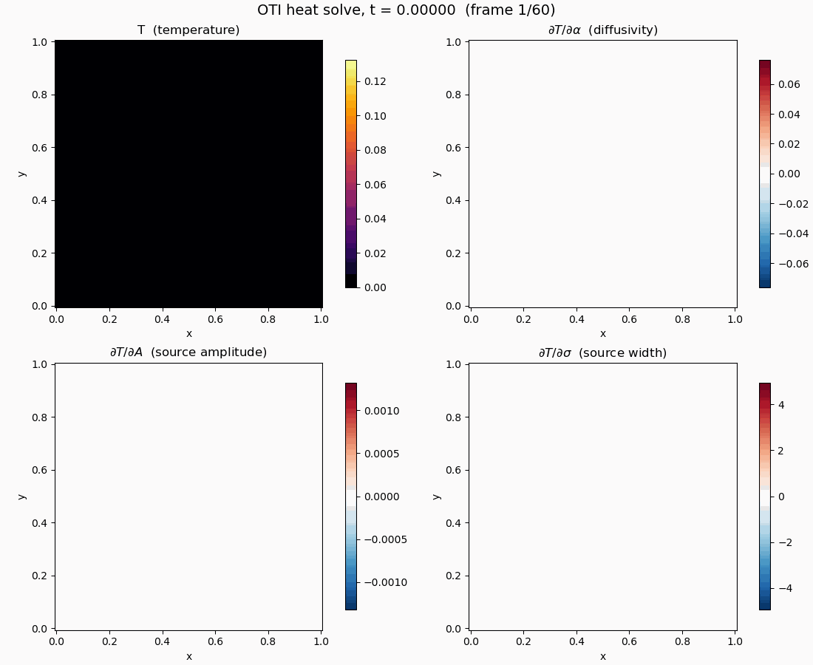

Heat Equation Sensitivities
===========================

The first PDE example: transient heat conduction on the unit cube,

.. code-block:: text

   dT/dt = alpha * Laplacian(T) + s(x, t; A, sigma)

discretized with trilinear finite elements (matrix-free, lumped mass, explicit
time stepping) on Kokkos, where the source ``s`` is a Gaussian of amplitude
``A`` and width ``sigma`` whose centre traces a circle through the domain. The
solver is the one from `Rombur/heat_equation
<https://github.com/Rombur/heat_equation>`_ with its scalar type swapped for

.. code-block:: cpp

   using Scalar = oti::otinum<3, 1>;   // (alpha, A, sigma), first order

and the three physical parameters seeded as OTI variables. One solve then
advances four coupled fields at once: the temperature and its exact
sensitivities ``dT/dalpha``, ``dT/dA``, ``dT/dsigma`` at every node and every
time step. The assembly kernels and the time loop are unchanged -- the
overloaded arithmetic carries the derivative coefficients through the same
code that advances the temperature.

*Top z-slice over the full simulation: temperature (top left) and the three
sensitivity fields from the same solve. The diffusivity sensitivity is
negative where the moving source has just deposited heat -- more diffusion
lowers the local peak -- while the amplitude and width sensitivities are
positive and track the deposited-energy trail.*

Validation Against Finite Differences
-------------------------------------

The run is an 81 x 81 x 81 grid (531,441 nodes), 2,400 explicit steps to
``t = 0.05``, in double precision. Each sensitivity field is checked at every
snapshot against central finite differences of the plain ``double`` solver
(step sizes ``h_alpha = 1e-4``, ``h_A = 1e-3``, ``h_sigma = 1e-5``), and the
OTI solution itself is checked against the plain solver:

.. list-table::
   :header-rows: 1
   :widths: 40 30 30

   * - Field
     - Reference
     - Max absolute error (all steps)
   * - ``T`` (solution)
     - plain ``double`` solve
     - 2.8e-17
   * - ``dT/dalpha``
     - central FD
     - 3.8e-10
   * - ``dT/dA``
     - central FD
     - 2.4e-14
   * - ``dT/dsigma``
     - central FD
     - 7.2e-08

Two readings:

* The solution error is at the last bit of ``double`` -- carrying the
  derivative coefficients does not perturb the primal solve.
* The sensitivity "errors" are the **finite differences' truncation error**,
  not OTI's: each is consistent with the chosen step size and the field's
  curvature in that parameter (``dT/dA`` is nearly exact because the solution
  is linear in the amplitude; ``dT/dsigma`` is the most nonlinear direction
  and shows the largest FD residual). The OTI derivatives have no step-size
  parameter to tune.

Sources
-------

The analysis harness (solver, FD comparison, CSV/animation outputs) is
``oti_heat_analysis.cpp`` + ``animate_oti_demo.py`` on the
`oti-analysis-and-benchmarks branch
<https://github.com/Samm-Py/heat_equation/tree/oti-analysis-and-benchmarks>`_
of the heat-equation fork. A minimal version of the same conversion -- the
upstream solver with an opt-in OTI target, where truncation order zero
recovers the ``double`` solve bit for bit -- was submitted upstream as
`Rombur/heat_equation PR #1 <https://github.com/Rombur/heat_equation/pull/1>`_.
