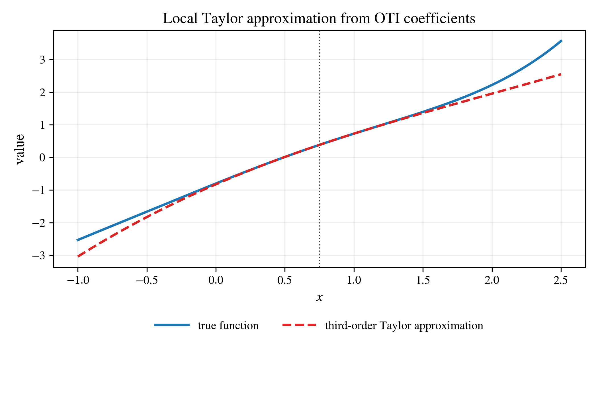

One-Dimensional Function
========================

The smallest complete demonstration: a scalar function of one variable,

.. code-block:: text

   f(x) = sin(1.3 x) + 0.25 x^3 - 0.8 exp(-0.5 x)

evaluated with ``otinum<1, 3>`` -- one variable, truncation order three. A
single overloaded evaluation at each sample point returns four numbers at
once: ``f(x)``, ``f'(x)``, ``f''(x)``, and ``f'''(x)``, read from the jet's
coefficients (the order-``k`` Taylor coefficient times ``k!`` is the ``k``-th
derivative).

.. code-block:: python

   import otinum as oti

   x = oti.OTI_1_3.variable(0, x0)   # x0 + unit perturbation in direction 0
   f = oti.sin(1.3 * x) + 0.25 * x**3 - 0.8 * oti.exp(-0.5 * x)

   value = f.real()
   d1    = f.partial([1])            # f'(x0)
   d2    = f.partial([2])            # f''(x0)
   d3    = f.partial([3])            # f'''(x0)

Sampling ``x`` across ``[-3, 3]`` and overlaying the OTI-derived values on the
analytic curves shows every order landing on its curve exactly -- there is no
step size to choose and no truncation error in the derivatives:

.. image:: ../_static/numerical_examples/ex1d_function_and_derivatives.png
   :alt: f and its first three derivatives; OTI samples on analytic curves
   :width: 85%
   :align: center

A Local Taylor Model For Free
-----------------------------

The same four coefficients are more than point values -- they are a
third-order Taylor expansion of ``f`` about the evaluation point. Using the
jet computed at ``x = 0.75`` directly as a polynomial reproduces the function
in a neighbourhood of the anchor and degrades smoothly away from it:

This "jet as a local surrogate" reading is the seed of the later examples:
:doc:`surrogate` applies it to a PDE solution, :doc:`uq_max_temperature`
integrates it against input distributions, and :doc:`digital_twin` adds a
certified region of validity around the anchor.

Running It
----------

The source is ``examples/python/one_dimensional.py`` (it also generates the
figures above). Build the Python bindings first
(:doc:`../tutorials/python_bindings`), then:

.. code-block:: console

   python examples/python/one_dimensional.py
