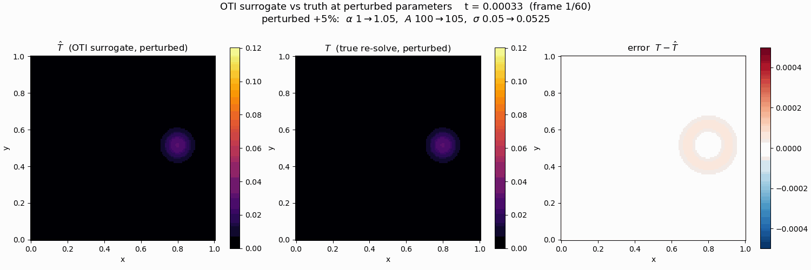

Perturbed Parameters: Surrogate vs. Truth
=========================================

The :doc:`heat_equation` example computes ``T`` and its three parameter
sensitivities in one solve. This example uses those coefficients a second
time -- as a **Taylor-series expansion (TSE)**, a polynomial surrogate that
predicts the solution at *different* parameter values without touching the
PDE again:

.. code-block:: text

   T(p + dp)  ~=  T(p) + dT/dalpha * d_alpha + dT/dA * d_A + dT/dsigma * d_sigma

evaluated nodewise, for the whole field, at every time step. The question is
how good that prediction is, so all three parameters are perturbed by **+5%**
at once (``alpha: 1 -> 1.05``, ``A: 100 -> 105``, ``sigma: 0.05 -> 0.0525``)
and the surrogate is compared against ground truth: a genuine re-solve of the
PDE at the perturbed parameters.

*Left: the surrogate field, a polynomial evaluation costing a few
floating-point operations per node. Middle: the true re-solve at the perturbed
parameters. Right: their difference over time.*

The two fields are visually indistinguishable; the pointwise error peaks at
about **5e-4** against a peak temperature of about 0.12 -- roughly 0.4% -- for
a simultaneous 5% move in all three parameters, from a *first-order* model.
The error field is also structured, not noise: it is dominated by the
second-order terms the ``otinum<3, 1>`` expansion truncates, concentrated
where the solution is most curved in the parameters (along the deposited-heat
trail).

What this buys, and what it doesn't
-----------------------------------

The surrogate answers "what does the field look like at nearby parameters?"
at polynomial-evaluation cost -- the basis of the two applications that
follow:

* :doc:`uq_max_temperature` integrates the surrogate against input
  probability distributions instead of evaluating it at one perturbed point,
  turning one solve into output statistics.
* :doc:`digital_twin` asks the question this page leaves open -- *how far* can
  the parameters move before the surrogate stops being trustworthy? -- and
  answers it with the library's validity layer (:doc:`../tutorials/validity`),
  which certifies a trust region around the anchor instead of eyeballing the
  error panel.

Going to ``otinum<3, 2>`` adds the Hessian to the expansion, shrinking the
truncated remainder by another order in the perturbation size; the UQ example
does exactly that, and needs to.

Sources
-------

Same harness as :doc:`heat_equation`, on the
`oti-analysis-and-benchmarks branch
<https://github.com/Samm-Py/heat_equation/tree/oti-analysis-and-benchmarks>`_
of the heat-equation fork: ``oti_heat_analysis.cpp`` exports the per-snapshot
sensitivity fields the surrogate is built from, and the ground-truth panel is
the same solver re-run at the perturbed parameters. The surrogate itself is
the one-line nodewise Taylor evaluation shown above -- there is deliberately
no machinery to point at.
