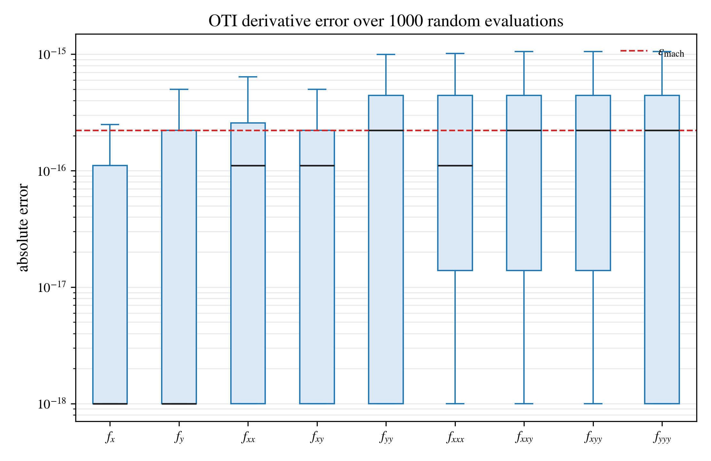

Two-Dimensional Function
========================

The multivariate counterpart of :doc:`one_dimensional`: a function of two
variables,

.. code-block:: text

   f(x, y) = sin(x y) + 0.35 x^2 - 0.2 y^3 + exp(-0.25 (x^2 + y^2))

evaluated with ``otinum<2, 3>`` -- two variables through total order three.
One evaluation now returns the value plus **nine** mixed partial derivatives:
the gradient (``f_x``, ``f_y``), the Hessian (``f_xx``, ``f_xy``, ``f_yy``),
and the four third-order partials (``f_xxx``, ``f_xxy``, ``f_xyy``,
``f_yyy``). Nothing about the function needs to be arranged for
differentiation; both inputs are seeded as variables and the overloaded
arithmetic tracks every cross term:

.. code-block:: python

   x = oti.OTI_2_3.variable(0, xv)   # xv + e_0
   y = oti.OTI_2_3.variable(1, yv)   # yv + e_1
   f = oti.sin(x * y) + 0.35 * x**2 - 0.2 * y**3 \
       + oti.exp(-0.25 * (x**2 + y**2))

   fxy  = f.partial([1, 1])          # d2f/dxdy
   fxxy = f.partial([2, 1])          # d3f/dx2dy

Accuracy Against Analytic Derivatives
-------------------------------------

The test draws **1000 random points** uniformly from ``[-2, 2] x [-2, 2]``
(fixed seed), computes all nine partials per point through the OTI evaluation,
and compares each against hand-derived analytic formulas. The absolute errors,
grouped by derivative, sit at machine precision:

Two things to read off the box plot:

* Every median is at or below machine epsilon (dashed line), for first-,
  second-, and third-order derivatives alike. The error does **not** grow with
  derivative order -- there is no differencing cascade, because nothing is
  being differenced; higher-order coefficients are computed by the same exact
  algebra as the value.
* The whiskers stay within a small multiple of machine epsilon. The scatter is
  ordinary floating-point rounding in the evaluation itself, the same noise a
  plain ``double`` evaluation of the analytic formula carries.

For contrast, a finite-difference estimate of a *third*-order mixed partial
requires a stencil of perturbed evaluations whose optimal step balances
truncation against catastrophic cancellation, and typically retains only a few
correct digits. Here the third-order coefficients are as accurate as the
function value.

Running It
----------

The source is ``examples/python/two_dimensional.py`` (it also generates
surface, gradient-field, and Hessian-determinant figures not shown here).
Build the Python bindings (:doc:`../tutorials/python_bindings`), then:

.. code-block:: console

   python examples/python/two_dimensional.py
