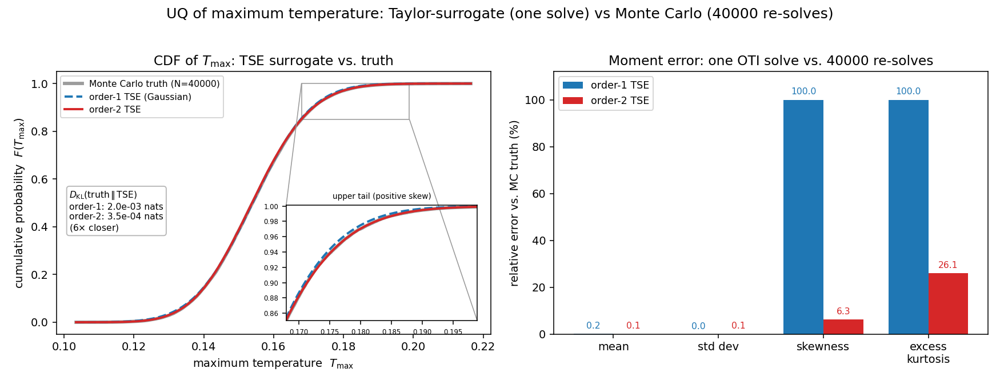

Uncertainty Quantification: One Solve vs. Monte Carlo
=====================================================

The :doc:`surrogate` example evaluated the Taylor expansion at one perturbed
point. This example integrates it against probability distributions: given
uncertain inputs, what is the *distribution* of a quantity of interest -- here
the *maximum temperature* of the :doc:`heat_equation` problem?

Setup:

* Inputs: ``alpha ~ N(1, 0.05^2)``, ``A ~ N(100, 5^2)``,
  ``sigma ~ N(0.05, 0.0025^2)`` -- independent, 5% coefficient of variation
  each.
* QoI: ``Q = max_x T(x, t_final)``, nominal value ``Q0 = 0.154``.
* **Reference**: brute-force Monte Carlo, ``N = 40,000`` genuine PDE
  re-solves.
* **OTI method**: **one** solve with ``otinum<3, 2>`` (order two now -- the
  Hessian matters here), giving a second-order TSE of ``Q`` in the three
  parameters. Moments of the TSE under the input distributions are then exact
  Gauss--Hermite integrals -- no sampling, no additional solves.

Results
-------

.. list-table::
   :header-rows: 1
   :widths: 22 20 20 20 9 9

   * - Moment
     - MC (truth)
     - Order-1 TSE
     - Order-2 TSE
     - o1 err%
     - o2 err%
   * - mean
     - 0.154206
     - 0.153961
     - 0.154124
     - 0.16
     - 0.05
   * - std dev
     - 0.013288
     - 0.013283
     - 0.013296
     - 0.03
     - 0.06
   * - skewness
     - 0.140
     - 0
     - 0.149
     - 100
     - 6.3
   * - excess kurtosis
     - 0.041
     - 0
     - 0.030
     - 100
     - 26

The pattern is structural, not incidental:

* **Mean and standard deviation** are captured by both orders to a fraction of
  a percent -- if second moments are all you need, a first-order (gradient)
  solve suffices.
* **Skewness is invisible to order 1.** A linear map of jointly Gaussian
  inputs is Gaussian, so a first-order TSE *cannot* produce asymmetry: it
  reports skewness exactly 0, a 100% error by construction, not by inaccuracy.
  The quadratic terms of the order-2 expansion are what bend the input
  Gaussian into the true right-skewed output (6% error, against an MC
  standard error of +/-0.0122 on skewness from 40,000 samples).
* The order-2 expansion also recovers the mean *shift* -- the true mean sits
  0.11% above the nominal ``Q0``, a pure second-order effect (a linear model's
  mean is exactly ``Q0``).
* The Kullback--Leibler divergence between the true (MC) distribution and the
  order-2 TSE distribution is **3.5e-4 nats -- below the Monte Carlo noise
  floor** at this sample count, and 6x smaller than order-1.

The cost comparison is one ``otinum<3, 2>`` solve versus 40,000 ``double``
solves. The OTI solve carries 10 coefficients per node instead of 1, so it
costs a small multiple of a single plain solve -- against a four-orders-of-
magnitude sampling budget, with no sampling noise in the result.

Sources
-------

``uq_max_temperature.cpp`` (the OTI solve, the QoI jet export, and the Monte
Carlo driver) and ``uq_moment_analysis.py`` (Gauss--Hermite moments, KL
divergence, the figure), on the `oti-analysis-and-benchmarks branch
<https://github.com/Samm-Py/heat_equation/tree/oti-analysis-and-benchmarks>`_
of the heat-equation fork.
