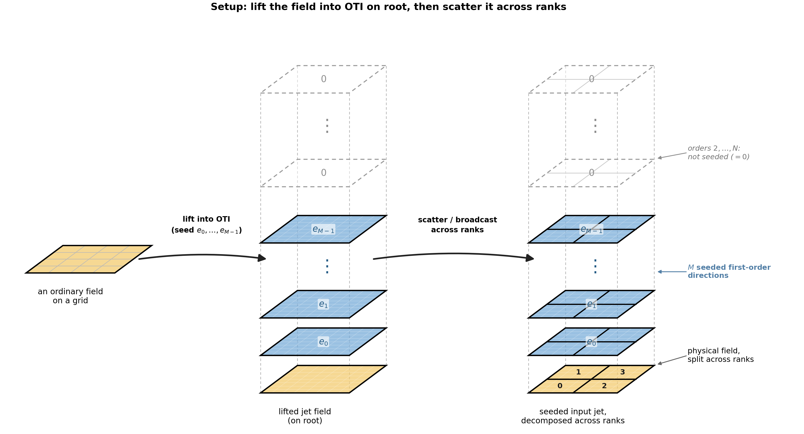
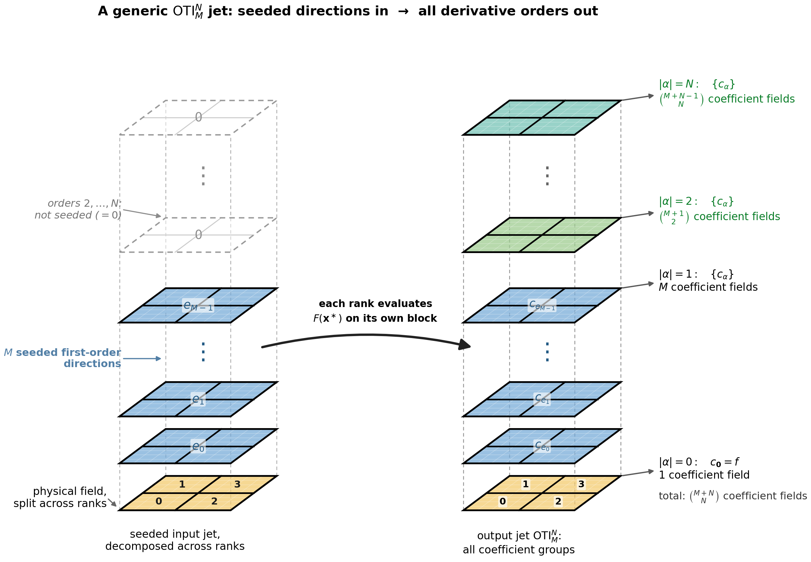

Independent Evaluation (Scatter / Gather)
=========================================

The first rung of the ladder is the simplest distributed pattern: each rank owns
a block, transforms it independently, and the data is *moved* in and out with
collective communication -- **no communication during the compute**.

The realistic shape is a round trip: the root **scatters** the input field to the
ranks, **broadcasts** any shared parameters, each rank transforms its block, and
the results are **gathered** back. Every element is an OTI jet, so each collective
moves the value *and* its derivatives together.

The General Pattern
-------------------

Replacing the scalar at each point with an OTI jet lifts the whole distributed
field into the algebra. The MPI decomposition does not change: each rank still
transforms the same block, but each element now carries the value and all
requested derivative coefficients. Scattering and gathering jets therefore move
the value field and the derivative fields together.

   First, the general setup, in order. An ordinary field on a grid (left) is
   **lifted into a generic** :math:`\mathrm{OTI}_M^N` **algebra** *on root* -- a
   pure local operation, no MPI -- gaining the :math:`M` first-order perturbation
   directions :math:`e_0,\ldots,e_{M-1}` to become the whole seeded jet field
   (middle). Only **then** is it **scattered / broadcast across ranks** (right),
   the first MPI step. Each seeded direction owns its own plane:
   :math:`e_0,e_1,\ldots,e_{M-1}`. Vertical dots denote the omitted directions
   between the explicitly drawn planes and, higher in the tower, omitted
   derivative orders. Orders :math:`2,\ldots,N` exist on input but are not seeded
   (they are zero until the evaluation fills them).

   Then, the generic evaluation. Each rank evaluates its block of the seeded
   input jet (left), where the :math:`M` first-order seeds occupy separate
   planes. One evaluation returns all coefficient groups through order
   :math:`N` (right). The output group for total degree :math:`k` contains
   :math:`\binom{M+k-1}{k}` coefficient fields, for
   :math:`\binom{M+N}{N}` fields in the complete jet. The colors distinguish
   conceptual order groups; they do not represent values of a particular
   function. The first-order output coefficients are expanded into matching
   planes :math:`c_{e_0},c_{e_1},\ldots,c_{e_{M-1}}`; higher orders remain
   grouped by total degree. Those higher orders, zero on input, **emerge from the
   algebra** during the evaluation. MPI still moves each complete jet as **one**
   ``MPI_OTINUM`` element. The schematic shows the general :math:`N>2` shape;
   lower-order algebras simply truncate the tower earlier. It is deliberately
   algebra-generic, while the concrete example below specializes it to
   ``otinum<2,1>``. The 2×2 rank layout is illustrative; that program uses a flat
   block decomposition.

The Concrete Example
--------------------

The before/after sources are ``mpi_oti_convert/convert_before.cpp`` and
``convert_after.cpp`` -- a plain **MPI** round trip (no Kokkos, no GPU) applying
``f(u; p) = sin(p · u)`` to a distributed field of 1000 points. ``u`` is the field
(seeded per point) and ``p`` is a shared parameter (broadcast to every rank).
``convert_before.cpp`` uses ``double`` throughout and prints a sample value;
the OTI version differs only by the changes below.

The Changes
-----------

.. code-block:: diff

   -using Scalar = double;
   +#include "otinum/otinum.hpp"   // 1. otinum core + oti:: math overloads
   +#include "otinum/mpi.hpp"      //    optional MPI datatype helper
   +
   +using Scalar = oti::otinum<2, 1, double>;   // 2. dir 0 = field u, dir 1 = param p

    // 0. THE KERNEL DOES NOT CHANGE -- overloaded ops carry the derivatives:
    static inline Scalar transform(Scalar u, Scalar p)
    {
        using std::sin;       // scalar fallback
        return sin(p * u);    // ADL selects oti::sin for an otinum
    }

   -        MPI_Datatype field_type = MPI_DOUBLE;
   +        MPI_Datatype field_type = oti::mpi::make_datatype<Scalar>();   // 4.

    // seeding the parameter and the field as variables:
   -    Scalar p = (rank == 0) ? P0 : 0.0;
   +    Scalar p;
   +    if (rank == 0) p = Scalar::variable(1, P0);          // 3. seed d/dp
        MPI_Bcast(&p, 1, field_type, 0, MPI_COMM_WORLD);
        ...
   -            in[g] = g * h;
   +            in[g] = Scalar::variable(0, g * h);          // 3. seed d/du

    // the Scatterv / compute / Gatherv are byte-for-byte identical

    // reading the result on rank 0:
   -            std::printf("sample value = %.8f\n", out[mid]);
   +            const Scalar& s = out[mid];                              // 5.
   +            std::printf("sample value = %.8f\n", s.coeff(oti::sparse({})));
   +            std::printf("        d/du = %.8f\n", s.coeff(oti::sparse({{0,1}})));
   +            std::printf("        d/dp = %.8f\n", s.coeff(oti::sparse({{1,1}})));
   +
   +        oti::mpi::free_datatype(field_type);   // release the committed type

What each change is for:

#. **Include the optional headers.** ``otinum/otinum.hpp`` provides the value
   type and mathematical functions such as ``oti::sin``;
   ``otinum/mpi.hpp`` adds the datatype helper. Neither is needed by code that
   does not use them, so non-OTI builds are unaffected. The kernel deliberately
   calls ``sin`` *unqualified* after ``using std::sin``: ordinary scalar
   arguments select ``std::sin``, while argument-dependent lookup finds
   ``oti::sin`` for an ``otinum``. A qualified call such as
   ``std::sin(p * u)`` would not perform OTI dispatch.
#. **Change the scalar type.** One ``using`` alias. Everything typed on ``Scalar``
   -- the buffers, the kernel -- follows automatically.
#. **Seed the inputs as variables.** This is the one genuinely new line of
   *logic*: declaring which quantities you want derivatives with respect to.
   ``Scalar::variable(0, u0)`` is ``u0`` carrying a unit first-order infinitesimal
   in direction 0; ``variable(1, P0)`` does the same for the parameter in
   direction 1. The parameter's perturbation rides along through ``MPI_Bcast``.
#. **Describe the element to MPI.** ``oti::mpi::make_datatype<Scalar>()`` replaces
   ``MPI_DOUBLE`` -- one committed datatype for the jet, used by ``Bcast``,
   ``Scatterv``, and ``Gatherv`` alike -- and is freed at the end.
#. **Read the derivatives out.** The gathered value is now a jet; pull its
   coefficients with ``coeff()`` (or use it directly in further OTI arithmetic).

Note what is **absent**: the ``transform()`` kernel, the decomposition, the
broadcast, the scatter, and the gather are byte-for-byte identical. The overloaded
arithmetic and elementary functions propagate the derivatives through unchanged
code -- that is the whole value proposition.

Movement vs Combining
---------------------

``Scatter``, ``Gather``, and ``Bcast`` here are all **movement** collectives --
along with ``Allgather`` and ``Alltoall`` -- that only *move* jets and never
combine them. They all need the same thing and nothing more: **the committed
datatype, no custom** ``MPI_Op``. In this example, each point is computed with the
same operations and in the same order as in the serial program, so moving the
finished jets does not change any coefficient: the gathered field is
**bit-identical** to the serial result at every tested rank count. Movement alone
does not introduce rounding, but bit-identical agreement still assumes the
parallel program has not changed the per-element computation.

That is the dividing line for the rest of the ladder. The next rung,
:doc:`reduce`, is the other family: collectives that *fold* jets together
(``Reduce``, ``Allreduce``) and so need a custom operator built on the same
datatype.

Build Changes
-------------

If ``cpp_oti_lib`` is installed as a CMake package, use its exported interface
target:

.. code-block:: cmake

    find_package(otinum CONFIG REQUIRED)
    find_package(MPI REQUIRED)

    add_executable(my_app my_app.cpp)
    target_link_libraries(my_app PRIVATE oti::otinum MPI::MPI_CXX)

Although ``otinum`` is header-only, linking the interface target is the CMake
mechanism that supplies its installed include directory and any usage
requirements recorded by the package, including optional Kokkos integration. It
does not add a compiled ``otinum`` library to the final executable. If the package
is installed under a non-standard prefix, point CMake to it while configuring:

.. code-block:: console

   cmake -S . -B build -DCMAKE_PREFIX_PATH=/path/to/otinum-install

For a source-tree-only checkout that has not been installed, adding the include
directory directly remains valid:

.. code-block:: cmake

   target_include_directories(my_app PRIVATE /path/to/cpp_oti_lib/include)
   target_link_libraries(my_app PRIVATE MPI::MPI_CXX)

For an application that already uses Kokkos, the additional **OTI-specific**
configuration is to enable ``OTI_ENABLE_KOKKOS`` so a jet is callable inside a
device kernel. Selecting and configuring the Kokkos backend, compiler wrapper,
and GPU architecture remain part of the application's normal Kokkos toolchain;
the complete setup is covered in :doc:`../../integration`.

The Result
----------

Both programs run identically; the OTI version simply knows more. Run each on the
same ranks:

.. code-block:: console

   mpirun -np 4 ./build/convert_before
   mpirun -np 4 ./build/convert_after

.. code-block:: text

   # convert_before
   sample value = 0.60570425

   # convert_after
   sample value = 0.60570425
           d/du = 1.03439682
           d/dp = 0.39824318

The value is unchanged (the OTI real part is the original computation), and the
derivatives come out alongside it -- ``d/du`` seeded per point and scattered,
``d/dp`` seeded once and broadcast. Because the collectives only move jets, the
sample is identical at every rank count. From here the full dependency model,
CMake recipe, the device-pointer vs host-staging transport choice, and the
toolchain gotchas are in :doc:`../../integration`.
