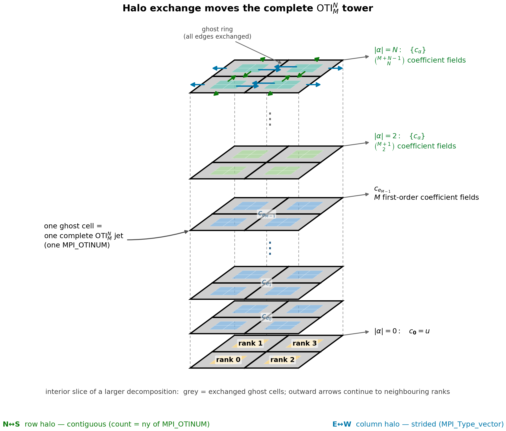
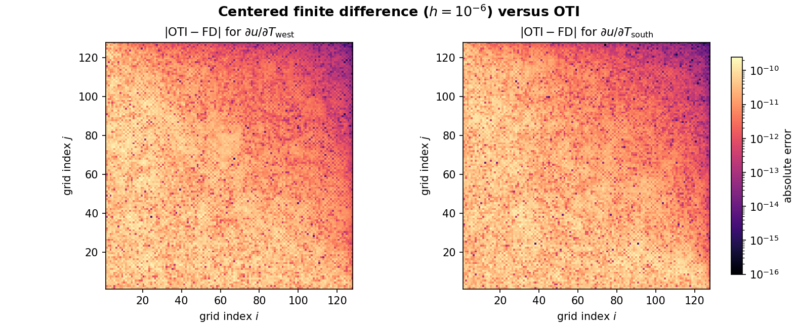

Halo Exchange
=============

The third rung introduces distributed computations that **communicate during the
compute**. Unlike the independent evaluation in :doc:`gather`, neighbouring
ranks repeatedly exchange parts of their local fields.

The General Pattern
-------------------

Each rank owns an interior tile plus ghost cells that mirror edge values owned
by neighbouring ranks. Before a local update reads those neighbours, the ranks
exchange their boundary data to refresh the ghost cells. With OTI, each grid
element is a complete jet, so the communication pattern is unchanged: MPI moves
the value and all derivative coefficients together as one ``MPI_OTINUM``.

   The same generic :math:`\mathrm{OTI}_M^N` tower used in :doc:`gather`, now
   placed over an interior 2×2 slice of a larger process decomposition. Separate
   planes show the value and first-order coefficients
   :math:`c_{e_0},c_{e_1},\ldots,c_{e_{M-1}}`; higher coefficients are grouped by
   total order, with vertical dots marking omitted directions and orders. Every
   grid cell is one complete jet, and a halo exchange moves that whole tower into
   a neighbouring ghost cell. Paired arrows show the two directions of each
   exchange; outward arrows indicate neighbours beyond the illustrated slice.
   The schematic is algebra-generic; the concrete solver below uses
   ``otinum<2,1>`` and therefore truncates after ``c_e1``.

The Concrete Example: A Jacobi Heat Solver
------------------------------------------

The example computes the steady-state temperature field on a unit square. The
West and South walls are hot, with temperatures :math:`T_\mathrm{west}=1` and
:math:`T_\mathrm{south}=1`; the North and East walls are held at zero. In the
interior it solves Laplace's equation,

.. math::

   \nabla^2 u = 0,

on a 128×128 grid. A fixed 4000 Jacobi iterations approximate the steady state,
using the 5-point update

.. math::

   u^{t+1}_{i,j} = \tfrac{1}{4}\,\bigl(u^{t}_{i-1,j} + u^{t}_{i+1,j}
                                       + u^{t}_{i,j-1} + u^{t}_{i,j+1}\bigr),

The grid is distributed over a 2D Cartesian arrangement of MPI ranks. Each
iteration first exchanges neighbouring edge values into the ghost cells and
then applies the stencil locally. The explicit sensitivity objective is to
measure how the full temperature field changes when either hot-wall boundary
condition changes. Because :math:`T_\mathrm{west}` and
:math:`T_\mathrm{south}` are seeded as independent OTI variables, the same solve
produces three fields: the temperature :math:`u`, the boundary-condition
sensitivity :math:`\partial u/\partial T_\mathrm{west}`, and the
boundary-condition sensitivity
:math:`\partial u/\partial T_\mathrm{south}`. The before/after sources are
``examples/mpi/halo/main_before.cpp`` (plain ``double``) and ``main.cpp`` (OTI).

Converting From Plain Double
^^^^^^^^^^^^^^^^^^^^^^^^^^^^

``main_before.cpp`` is the same distributed solver in ordinary ``double``: 2D
Cartesian ranks, the row/column halo exchange every iteration, verified bit-exact
against a serial recompute. It produces the temperature field and nothing else.
OTI-enabling it is the same family of changes as every other rung, with the halo
twist that the datatypes are *derived* from the jet element:

.. code-block:: diff

   -using Scalar = double;
   +#include "otinum/otinum.hpp"                       // 1. otinum core
   +#include "otinum/mpi.hpp"                           //    MPI datatype helper
   +using Jet = oti::otinum<2, 1, double>;              // 2. value + 2 sensitivities

    // hot-wall boundary values
   -const Scalar T_WEST  = 1.0;
   -const Scalar T_SOUTH = 1.0;
   +const Jet T_WEST  = Jet::variable(0, 1.0);          // 3. seed T_west = 1 + e_0
   +const Jet T_SOUTH = Jet::variable(1, 1.0);          //    seed T_south = 1 + e_1

    // ... the Jacobi stencil and the four Sendrecv calls keep their shape ...

    // 4. build the halo datatypes on the jet element instead of MPI_DOUBLE
   -MPI_Datatype row_type = MPI_DOUBLE;                  // a row is ny doubles
   -MPI_Type_vector(nx, 1, stride, MPI_DOUBLE, &MPI_COL);// a column is strided doubles
   +MPI_Datatype MPI_OTINUM = oti::mpi::make_datatype<Jet>();  // one committed jet
   +MPI_Type_vector(nx, 1, stride, MPI_OTINUM, &MPI_COL);// a column is strided jets

   +// 5. read the sensitivities out of the converged jet
   +const double dudTw = s.coeff(oti::sparse({{0, 1}}));  // du/dT_west
   +const double dudTs = s.coeff(oti::sparse({{1, 1}}));  // du/dT_south

The scalar type, the seeding, the datatypes, and reading the derivatives are the
only changes; the stencil and the exchange structure are untouched (the row and
column ``Sendrecv`` calls just carry ``MPI_OTINUM`` in place of ``MPI_DOUBLE``).
The sections below walk through the pieces, and the OTI build additionally
verifies the new sensitivities against finite differences.

The OTI Angle: Sensitivities For Free
^^^^^^^^^^^^^^^^^^^^^^^^^^^^^^^^^^^^^

The two hot walls carry their temperature as **seeded variables** rather than
plain numbers because they are the boundary-condition parameters with respect
to which derivatives are requested:

.. code-block:: cpp

   using Jet = oti::otinum<2, 1, double>;          // value + d/dT_west + d/dT_south

   const Jet T_WEST  = Jet::variable(0, 1.0);      // 1.0 + e_0
   const Jet T_SOUTH = Jet::variable(1, 1.0);      // 1.0 + e_1
   const Jet T_COLD  = Jet(0.0);

Every cell then converges to a jet whose coefficients are the temperature *and*
its derivative with respect to each wall -- the parameter sensitivity of the
entire field, from one solve. The stencil code is unchanged; the arithmetic is
overloaded, so ``(a + b + c + d) * 0.25`` propagates the derivatives
automatically.

Decomposition: A 2D Cartesian Grid
^^^^^^^^^^^^^^^^^^^^^^^^^^^^^^^^^^

Letting MPI choose the process grid and wiring up neighbours is a few lines:

.. code-block:: cpp

   int dims[2] = {0, 0};
   MPI_Dims_create(world_size, 2, dims);          // factor ranks into Px x Py
   int periods[2] = {0, 0};                        // non-periodic: walls, not torus
   MPI_Comm cart;
   MPI_Cart_create(MPI_COMM_WORLD, 2, dims, periods, /*reorder=*/1, &cart);

   int up, down, left, right;
   MPI_Cart_shift(cart, 0, 1, &up, &down);         // dim 0 = rows (i)
   MPI_Cart_shift(cart, 1, 1, &left, &right);      // dim 1 = columns (j)

Each rank owns an ``nx × ny`` interior tile wrapped in a one-cell **ghost layer**
(local array stride ``ny + 2``). ``MPI_Cart_shift`` returns ``MPI_PROC_NULL`` for
neighbours off the edge of the grid, which is the key simplification for the
boundary: ghost layers that coincide with a Dirichlet wall are filled once with
the wall temperature and never touched again, because a ``Sendrecv`` to or from
``MPI_PROC_NULL`` is a no-op.

The Two Halo Datatypes
^^^^^^^^^^^^^^^^^^^^^^

This is where the committed jet element pays off a second time. Both halos are
described in units of *jets*, built on ``MPI_OTINUM``:

.. code-block:: cpp

   MPI_Datatype MPI_OTINUM = oti::mpi::make_datatype<Jet>();

   // Column halo (E/W): nx jets, one per row, strided by `stride` jets.
   MPI_Datatype MPI_COL;
   MPI_Type_vector(nx, 1, stride, MPI_OTINUM, &MPI_COL);
   MPI_Type_commit(&MPI_COL);
   // Row halo (N/S) is contiguous -> just `ny` of MPI_OTINUM, no derived type.

A **row** (north/south neighbour) is a contiguous run of ``ny`` jets, so it ships
as ``count = ny`` of ``MPI_OTINUM`` with no extra type. A **column** (east/west
neighbour) is one jet per row, separated by a full row stride, so it needs
``MPI_Type_vector`` *over* the jet element -- a derived datatype on a derived
datatype. The stride is in jets, not bytes: MPI knows the extent of one
``MPI_OTINUM`` is exactly ``sizeof(Jet)`` (the jet is padding-free, see
:doc:`../index`), so the strided gather lands on jet boundaries with no
byte arithmetic.

The Exchange
^^^^^^^^^^^^

Each iteration, before sweeping the interior, every rank swaps edges with its
neighbours using ``MPI_Sendrecv`` (which avoids deadlock without manual ordering):

.. code-block:: cpp

   // Rows (contiguous, count = ny): send an edge interior row, receive a ghost row.
   MPI_Sendrecv(&cur[idx(nx, 1)], ny, MPI_OTINUM, down, 0,
                &cur[idx(0, 1)],  ny, MPI_OTINUM, up,   0, cart, MPI_STATUS_IGNORE);
   MPI_Sendrecv(&cur[idx(1, 1)],      ny, MPI_OTINUM, up,   1,
                &cur[idx(nx + 1, 1)], ny, MPI_OTINUM, down, 1, cart, MPI_STATUS_IGNORE);

   // Columns (strided, one MPI_COL): same pattern in the j direction.
   MPI_Sendrecv(&cur[idx(1, ny)], 1, MPI_COL, right, 2,
                &cur[idx(1, 0)],  1, MPI_COL, left,  2, cart, MPI_STATUS_IGNORE);
   MPI_Sendrecv(&cur[idx(1, 1)],      1, MPI_COL, left,  3,
                &cur[idx(1, ny + 1)], 1, MPI_COL, right, 3, cart, MPI_STATUS_IGNORE);

   jacobi_sweep(cur, next, nx, ny, stride);
   std::swap(cur, next);

Edge ranks send to ``MPI_PROC_NULL`` on their outward sides, so those calls do
nothing and the Dirichlet ghosts survive.

Verify Without A Gather
^^^^^^^^^^^^^^^^^^^^^^^

Jacobi at iteration *t* depends only on the full field at *t-1*, so it is
fully deterministic regardless of how the domain is split. The example exploits
that: every rank redundantly runs the *identical* serial solve on the whole
domain (the stencil function ``jacobi_sweep`` is shared verbatim by both paths)
and compares its own tile against the matching subblock. The distributed result
is **bit-for-bit identical** to serial -- including every derivative coefficient
-- because the halo exchange transports the exact IEEE bytes and the arithmetic
order never changes. No ``MPI_Gatherv`` is needed; the only real communication is
the halo exchange itself, which is the point of this rung.

Finite-Difference Sensitivity Check
^^^^^^^^^^^^^^^^^^^^^^^^^^^^^^^^^^^

The executable also verifies the OTI sensitivities independently using centered
finite differences. Rank 0 repeats the serial solve with plain ``double``
arithmetic at :math:`T_\mathrm{west}=1\mathbin{\pm}10^{-6}` and
:math:`T_\mathrm{south}=1\mathbin{\pm}10^{-6}`:

.. math::

   \frac{\partial u}{\partial T}
   \approx \frac{u(T+h)-u(T-h)}{2h},
   \qquad h=10^{-6}.

At the centre, both slopes agree with the corresponding OTI coefficients to
better than :math:`6\times10^{-11}`. An absolute error above
:math:`10^{-8}` fails the executable, so the finite-difference comparison is
also CI-gateable.

   Absolute error over the full 128×128 interior grid. The maximum errors are
   :math:`2.459\times10^{-10}` for the West-wall sensitivity and
   :math:`2.443\times10^{-10}` for the South-wall sensitivity. The log scale
   makes roundoff-level spatial variation visible.

The executable can export the plotted data, and the companion script reproduces
the figure:

.. code-block:: console

   mpirun -np 4 ./mpi_oti_halo --fd-error-csv fd_error.csv
   python3 plot_fd_error.py fd_error.csv mpi_halo_fd_error.png

Build And Run
^^^^^^^^^^^^^

.. code-block:: console

   cd examples/mpi/halo
   mpicxx -std=c++17 -O2 -I ../../../include main.cpp -o mpi_oti_halo
   mpirun -np 4 ./mpi_oti_halo

.. code-block:: text

   sample @ global centre (64,64), owned by cart rank 0 (0,0):
     temperature        =  0.25964034
     d/dT_west          =  0.12982017
     d/dT_south         =  0.12982017
   ---
   process grid       : 2 x 2  (4 ranks)
   interior grid      : 128 x 128  (4000 Jacobi iterations)
   verify vs serial   : PASS (bit-exact) (0 mismatching jets)
   finite difference  : centred, h = 1.0e-06
     d/dT_west        : OTI = 0.1298201696, FD = 0.1298201695, |error| = 2.634e-11
     d/dT_south       : OTI = 0.1298201696, FD = 0.1298201696, |error| = 5.693e-11
     max grid error   : West = 2.459e-10, South = 2.443e-10
   verify sensitivities: PASS (tolerance 1.0e-08)

``MPI_Dims_create`` factors the rank count into the process grid: ``4 → 2×2``,
``6 → 3×2``, ``9 → 3×3`` (these exercise the strided column halo), while a prime
count gives a 1D strip. Verified bit-exact at ``np = 1, 2, 3, 4, 6, 7, 9``; the
program returns nonzero on a distributed mismatch or failed finite-difference
comparison, so it is CI-gateable.

The sample output doubles as a correctness check on the *derivatives*: the
problem is linear and both walls are at 1.0, so the temperature equals the sum of
the two sensitivities, and by symmetry across the diagonal the West and South
sensitivities are equal -- which is exactly what the jet reports.
