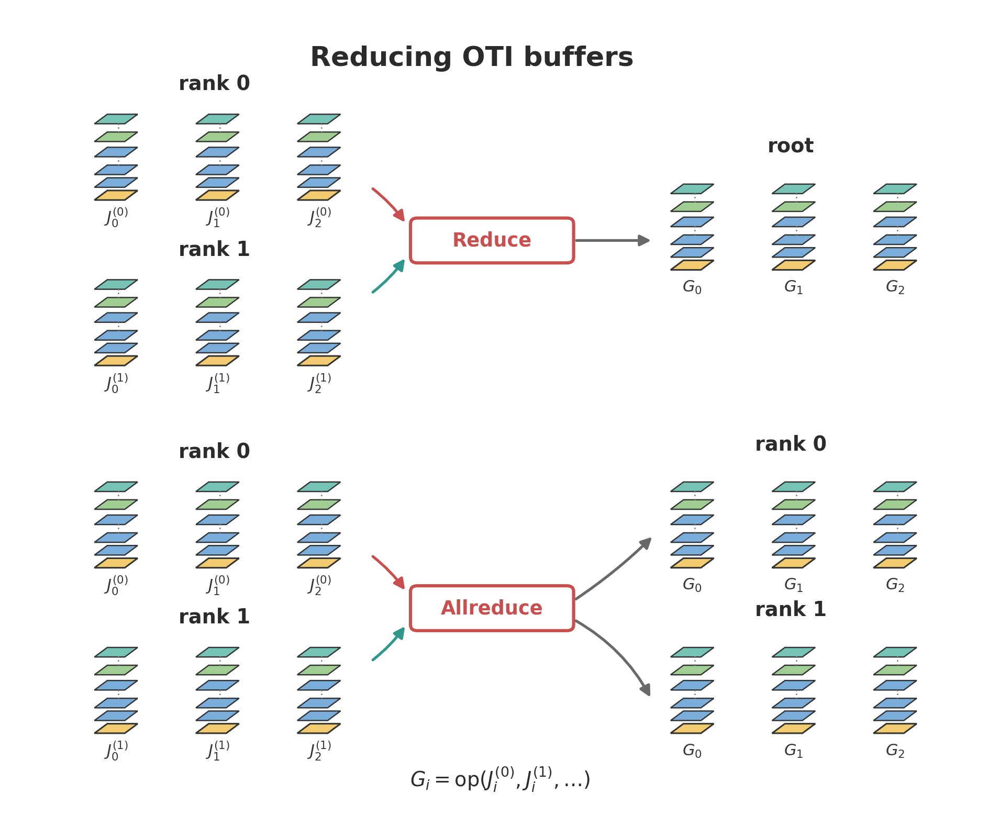
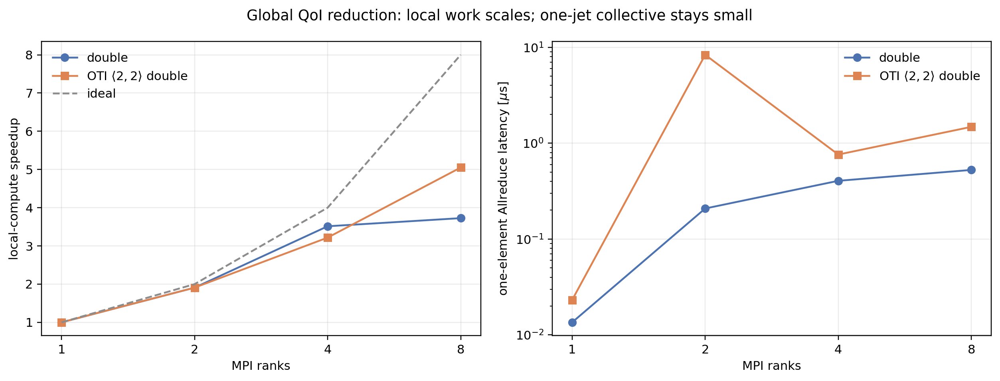

Global Reduction (Custom MPI_Op)
================================

The second rung: still one collective, but now it *combines* values rather than
just collecting them. We compute a global **quantity of interest** -- a single
number summed over the whole distributed field -- and because the inputs are OTI
values, the reduced result carries the complete coefficient set for whatever
``otinum<M, N, Coeff>`` shape you chose. In this worked example the chosen shape
is ``otinum<2, 2, double>``, so those coefficients can be read as first- and
second-order derivatives of the global objective. A different ``M`` or ``N`` uses
the same MPI reduction pattern.

   Each tower is one complete OTI value. A rank may contribute one tower or an
   array of them, and MPI matches buffer positions: ``J_0`` with ``J_0``, ``J_1``
   with ``J_1``, and so on. The result element ``G_i`` is the chosen reduction
   operation applied to the matching input OTI values. ``MPI_Reduce`` (top)
   delivers the reduced buffer to root only; ``MPI_Allreduce`` (bottom) delivers
   the same reduced buffer to every rank. The reduction operation is unchanged --
   only the delivery differs.

The before/after sources are ``examples/mpi/reduce/main_before.cpp`` (plain ``double``)
and ``main.cpp`` (OTI); the differences are the changes below.

The Starting Point
------------------

``main_before.cpp`` is an ordinary MPI reduction: each rank sums its block of
``f(x, y; a, b) = sin(a·x)·exp(b·y)`` over an ``N × N`` grid, and one
``MPI_Allreduce(MPI_SUM)`` over ``double`` produces the global mean. It computes
the QoI *value* and nothing else.

The Changes
-----------

.. code-block:: diff

   -using Scalar = double;
   +#include "otinum/otinum.hpp"                    // 1. otinum core
   +#include "otinum/mpi.hpp"                        //    datatype + reduction op
   +using Jet = oti::otinum<2, 2, double>;           // 2. two directions, order two

    // design parameters
   -const Scalar a = A0;
   -const Scalar b = B0;
   +const Jet a = Jet::variable(0, A0);              // 3. seed a = A0 + e_0
   +const Jet b = Jet::variable(1, B0);              //    seed b = B0 + e_1

    // partial sum over this rank's block -- THE LOOP DOES NOT CHANGE
   -Scalar local = 0.0;
   +Jet local(0.0);
    for (long k = 0; k < count; ++k) local += field(start + k, a, b);

   +// 4. one datatype + one reduction op, both from the header
   +MPI_Datatype MPI_OTINUM  = oti::mpi::make_datatype<Jet>();
   +MPI_Op       MPI_OTI_SUM = oti::mpi::make_sum_op<Jet>();

   -MPI_Allreduce(&local, &global, 1, MPI_DOUBLE, MPI_SUM,     MPI_COMM_WORLD);
   +MPI_Allreduce(&local, &global, 1, MPI_OTINUM, MPI_OTI_SUM, MPI_COMM_WORLD);

   +// 5. read the derivatives out of the reduced jet
   +const double d_da = qoi.coeff(oti::sparse({{0, 1}}));   // dQoI/da
   +const double d_db = qoi.coeff(oti::sparse({{1, 1}}));   // dQoI/db
   +//   plus the three second-order coefficients -- the Hessian

What each change is for:

#. **Include the optional headers.** ``otinum/mpi.hpp`` provides *both* the
   datatype and the reduction operator.
#. **Change the scalar type** to the OTI shape needed by this example: two
   derivative directions through order two. cpp_oti_lib is agnostic to order; the
   reduction code works the same for any ``otinum<M, N, Coeff>``.
#. **Seed the design parameters** as variables -- the one new line of intent,
   declaring what you want sensitivities with respect to.
#. **Describe the element and the combine to MPI.** ``make_datatype<Jet>()``
   replaces ``MPI_DOUBLE``; ``make_sum_op<Jet>()`` replaces ``MPI_SUM``. The
   ``Allreduce`` call is otherwise identical.
#. **Read the derivatives out** of the reduced jet with ``coeff()``.

The summation loop and the decomposition are unchanged: the overloaded ``+=``
carries the derivatives through the same code.

Reducing Multiple OTI Values Per Rank
-------------------------------------

The example above reduces one local QoI per rank, so the MPI count is ``1``. If a
rank owns several OTI values, use the same datatype and operator with the usual
MPI count semantics: ``count`` is the number of OTI elements, not the number of
coefficients. MPI may hand several elements to the reduction callback at once, and
``otinum/mpi.hpp`` applies the combine element-by-element.

Put another way, ``MPI_Reduce`` does **not** always collapse a buffer to one
number. It reduces ``count`` input elements into ``count`` output elements on the
root. ``count=1`` with ``MPI_DOUBLE`` gives one scalar; ``count=1`` with
``MPI_OTINUM`` gives one reduced OTI value; ``count=n`` with ``MPI_OTINUM`` gives
``n`` reduced OTI values.

.. code-block:: cpp

   std::vector<Jet> local(n), global(n);
   MPI_Datatype MPI_OTINUM  = oti::mpi::make_datatype<Jet>();
   MPI_Op       MPI_OTI_SUM = oti::mpi::make_sum_op<Jet>();

   MPI_Allreduce(local.data(), global.data(),
                 static_cast<int>(local.size()),
                 MPI_OTINUM, MPI_OTI_SUM, MPI_COMM_WORLD);

   oti::mpi::free_op(MPI_OTI_SUM);
   oti::mpi::free_datatype(MPI_OTINUM);

Element ``global[i]`` is the reduction of ``local[i]`` across ranks. If each rank
has a variable number of local OTI values that should first be accumulated into
one global QoI, keep the local C++ loop and reduce the resulting single ``Jet``.
If the variable-length values are separate global entries, first put them into a
matching global layout, or use the appropriate variable-count movement collective
before reducing.

.. note::

   ``Allreduce`` is a choice, not a requirement. The custom ``MPI_Op`` is
   orthogonal to the collective -- it works unchanged with ``MPI_Reduce``
   (result on root only), ``MPI_Reduce_scatter``, and the rest. Use
   ``MPI_Allreduce`` when *every* rank needs the reduced jet (e.g. an
   optimisation step where all ranks update the design parameters from the
   reduced coefficients, as here); use the cheaper ``MPI_Reduce(..., root,
   ...)`` when only one rank consumes the QoI and its sensitivities (logging,
   output). The same op and datatype work in either collective.
   ``test_reduce_ops.cpp`` checks ``MPI_Reduce`` against ``MPI_Allreduce`` for all
   four shipped operators. The comparison is tolerance-based because MPI may use
   different reduction trees for the two collectives.

The Reduction Operator
----------------------

MPI can ``MPI_SUM`` an ``int`` or a ``double``, but it has no idea how to combine
an ``otinum``. ``otinum/mpi.hpp`` supplies the operator so you do not hand-roll
it:

.. code-block:: cpp

   MPI_Op MPI_OTI_SUM = oti::mpi::make_sum_op<Jet>();   // build + commit
   // ... use in MPI_Reduce / MPI_Allreduce over MPI_OTINUM ...
   oti::mpi::free_op(MPI_OTI_SUM);                       // release

Under the hood the helper is one generic builder, ``make_reduce_op<T, Op>``, that
adapts any stateless combine functor ``Op`` to the fixed MPI callback shape:

.. code-block:: cpp

   struct add_jets { template <class T> T operator()(T const& a, T const& b) const { return a + b; } };

   template <class T, class Op>
   void reduce_fn(void* in, void* inout, int* len, MPI_Datatype*) {
       const T* a = static_cast<const T*>(in);
       T*       b = static_cast<T*>(inout);
       for (int i = 0; i < *len; ++i) b[i] = Op{}(a[i], b[i]);   // Op = the jet math
   }
   // make_sum_op<T>() == make_reduce_op<T, add_jets>()

That loop is **not** re-defining jet addition: ``Op{}(a[i], b[i])`` *is*
``otinum::operator+`` (for the sum combine). It is there because MPI's reduction
callback is type-erased and buffer-oriented -- MPI hands the operator two raw
``void*`` buffers of ``*len`` elements at once, so the function casts them to
``Jet*`` and applies the already-defined arithmetic across the batch. (``*len``
is 1 for a single QoI, but MPI may batch many elements per call, so the loop is
required.) That glue is exactly what the header writes once, for every jet shape.

.. note::

   For a **sum**, jet addition is coefficient-wise, so this reduction is
   equivalent to an ``MPI_SUM`` over the ``ncoeffs`` raw doubles of each jet -- you
   could skip the custom op. It is the *general* mechanism: required the moment the
   combine is not coefficient-wise (reducing a **product** of jets, where
   ``operator*`` is a convolution that mixes coefficients), and it keeps the
   reduction expressed in ``MPI_OTINUM`` units.

Other Reductions
^^^^^^^^^^^^^^^^

``otinum/mpi.hpp`` ships the same family for the other common combines, all built
on ``make_reduce_op``:

* ``make_sum_op<T>()`` -- an additive QoI (all coefficients of a global sum).
* ``make_prod_op<T>()`` -- a multiplicative QoI. Jet ``operator*`` is a
  convolution, so this genuinely *cannot* be done with ``MPI_SUM`` over the raw
  coefficients -- the clearest case for a custom op.
* ``make_maxloc_op<T>()`` / ``make_minloc_op<T>()`` -- the largest / smallest
  field value together with its complete jet and location. These operate on
  ``oti::mpi::value_loc<T>`` and resolve exact value ties by the smaller location,
  matching ``MPI_MAXLOC`` / ``MPI_MINLOC`` semantics.

For any other associative combine, pass your own functor:
``oti::mpi::make_reduce_op<Jet, MyCombine>()``. The confidence test
``examples/mpi/reduce/test_reduce_ops.cpp`` checks all four shipped operators -- value
and derivatives -- against a serial recompute.

An extremum reduction uses a matching value-plus-location datatype:

.. code-block:: cpp

   using LocatedJet = oti::mpi::value_loc<Jet>;

   LocatedJet local{local_jet, global_index};
   LocatedJet global;

   MPI_Datatype MPI_OTINUM_LOC =
       oti::mpi::make_value_loc_datatype<Jet>();
   MPI_Op MPI_OTI_MAXLOC = oti::mpi::make_maxloc_op<Jet>();

   MPI_Allreduce(&local, &global, 1, MPI_OTINUM_LOC,
                 MPI_OTI_MAXLOC, MPI_COMM_WORLD);

   // global.value carries the winning value and derivatives;
   // global.location identifies where that candidate came from.

   oti::mpi::free_op(MPI_OTI_MAXLOC);
   oti::mpi::free_datatype(MPI_OTINUM_LOC);

The location should uniquely identify a candidate, such as an MPI rank for one
candidate per rank or a global mesh index for a distributed field. At an exact
tie, the smaller location wins deterministically. The selected derivatives are
therefore explicit, but the mathematical ``max``/``min`` function is still
nondifferentiable where multiple candidates tie; the location records which
one-sided branch was selected.

Verification, Accuracy, And Scaling
-----------------------------------

Reduction needs a different validation strategy from pure movement. Floating-point
addition is **not associative**, so changing the rank count changes the reduction
tree and therefore the final few rounding bits. The example uses tolerance-based
checks, independent derivative references, and a dedicated timing harness.

Build And Run
^^^^^^^^^^^^^

.. code-block:: console

   cd examples/mpi/reduce
   mpicxx -std=c++17 -O2 -I ../../../include main.cpp -o mpi_oti_reduce
   mpirun -np 4 ./mpi_oti_reduce

.. code-block:: text

   ranks              : 4
   grid               : 1000 x 1000  (1000000 points)
   QoI = mean of sin(a x) exp(b y)  at a=1.000, b=1.000
     value            =  0.7898879935
     d/da             =  0.6558559384
     d/db             =  0.4598239459
     d2/da2  (Taylor) = -0.1919838760  (= QoI_aa / 2)
     d2/dadb (Taylor) =  0.3817987715  (= QoI_ab)
     d2/db2  (Taylor) =  0.1652296880  (= QoI_bb / 2)
   verify vs serial   : PASS (max relative diff 3.20e-14)
   analytic coeffs    : PASS (max absolute error 2.52e-14)
   finite difference  : centred, h = 1.0e-06
     d/da : OTI =  0.6558559384, FD =  0.6558559443, |error| = 5.96e-09
     d/db : OTI =  0.4598239459, FD =  0.4598239321, |error| = 1.38e-08
   verify gradient    : PASS (tolerance 1.0e-06)

The program returns nonzero if any check fails, so it is CI-gateable. The three
second-order coefficients in this ``otinum<2, 2, double>`` example represent the
QoI's Hessian -- the curvature of a global objective over the whole distributed
field -- and they arrive in the same collective as the real value and first-order
coefficients. The OTI payload is larger than one ``double``, but no additional
reduction call is required.

Operator Confidence Test
^^^^^^^^^^^^^^^^^^^^^^^^

``test_reduce_ops.cpp`` exercises the generic reduction callback beyond this one
QoI. Each rank contributes an array of three jets, forcing the callback's
``len > 1`` path, and the program checks ``sum``, ``product``, ``maximum with
location``, and ``minimum with location`` against a serial recompute. One array
element deliberately ties in value across all ranks while carrying different
derivatives; both location reductions select rank 0. The program also checks
that ``MPI_Reduce`` and ``MPI_Allreduce`` agree on root to tolerance:

.. code-block:: console

   cd examples/mpi/reduce
   mpicxx -std=c++17 -O2 -I ../../../include test_reduce_ops.cpp -o test_reduce_ops
   mpirun -np 4 ./test_reduce_ops

.. code-block:: text

   oti::mpi reduction-op test (4 ranks, 3 elems/reduce)
     make_sum_op  : PASS
     make_prod_op : PASS
     make_maxloc_op: PASS
     make_minloc_op: PASS
     value_loc datatype: PASS
     Reduce vs Allreduce on root (tolerance): PASS
     sample[0]: sum=2.6000 (d=10.0)  prod=0.168000 (d=2.4560)  max=0.8000 at rank 3 (d=4.0)
     tie[2]: maxloc rank=0, minloc rank=0 (expected 0)

This separates two questions: whether the OTI operators combine jets correctly,
and whether a particular QoI happens to use the sum operator.

Derivative Accuracy Across Rank Counts
^^^^^^^^^^^^^^^^^^^^^^^^^^^^^^^^^^^^^^^

``main.cpp`` applies three independent checks:

* **Distributed vs serial OTI** compares all six jet coefficients against a
  single-process recompute. This isolates reduction-order rounding.
* **Closed-form derivatives** compare the value, both gradient entries, and all
  three normalized Hessian coefficients against direct analytical formulas
  evaluated over the same discrete grid.
* **Centred finite differences** independently check ``d/da`` and ``d/db`` with
  ``h = 1e-6``.

On this local run, every check passes from 1 through 8 ranks:

.. list-table::
   :header-rows: 1

   * - Ranks
     - Max relative difference vs serial OTI
     - Max absolute error vs analytical coefficients
   * - 1
     - 0.00e+00
     - 2.22e-16
   * - 2
     - 2.15e-14
     - 1.39e-14
   * - 4
     - 3.20e-14
     - 2.52e-14
   * - 8
     - 3.56e-14
     - 2.80e-14

The small growth with rank count is ordinary summation-order roundoff, not
derivative truncation. The finite-difference errors remain 5.96e-09 for ``d/da``
and 1.38e-08 for ``d/db`` at every rank count because the reduced OTI derivatives
are stable far below the finite-difference error floor.

Strong Scaling
^^^^^^^^^^^^^^

``mpi_oti_reduce_scaling`` times only the distributed algorithm: local
accumulation over a fixed 1000×1000 grid, followed by one ``MPI_Allreduce``.
Serial recomputation and finite-difference verification are deliberately excluded.
It reports both the plain-``double`` baseline and ``otinum<2,2,double>``:

.. code-block:: console

   cd examples/mpi/reduce
   cmake -S . -B build
   cmake --build build --target mpi_oti_reduce_scaling
   : > reduce_scaling.csv
   for np in 1 2 4 8; do
     mpirun -np $np ./build/mpi_oti_reduce_scaling |
       { [ $np -eq 1 ] && cat || tail -n +2; } >> reduce_scaling.csv
   done
   python3 plot_scaling.py reduce_scaling.csv mpi_reduce_scaling.png

The local accumulation is the dominant cost. On this 8-core laptop, the OTI path
scales from 1.09 s at one rank to 0.22 s at eight ranks, about **5.1× speedup**;
the plain-double path reaches about **3.7×** before its much smaller workload
becomes overhead- and bandwidth-limited.

The right panel isolates the latency of reducing one QoI. It stays in the
microsecond range, versus hundreds of milliseconds for the OTI accumulation, so
one global jet reduction is negligible in this workload. The curve is not
monotonic: collective algorithms, process placement, and the local MPI runtime
can change abruptly with rank count (the 2-rank OTI point is a reproducible local
outlier). Treat these numbers as a worked measurement method, not portable
cluster performance. The structural conclusion is the useful one: local field
evaluation scales with the decomposition, while the fixed-size global reduction
eventually becomes the strong-scaling floor.
