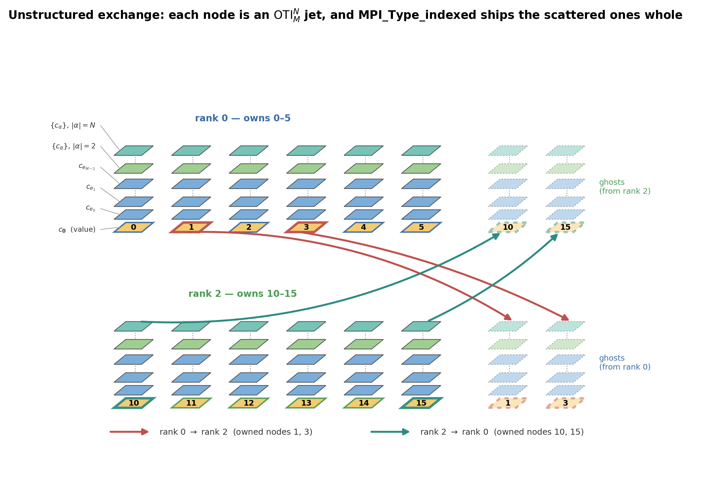

Unstructured Meshes (Indexed Ghost Lists)
=========================================

The fourth rung removes the last bit of regularity. The halo rung in
:doc:`halo` communicated over a **structured** grid, where a neighbour's ghost
data is contiguous (a row) or strided (a column) -- shapes that
``MPI_Type_vector`` describes. Real unstructured meshes have no such regularity:
the nodes another rank needs from me are an **arbitrary, scattered subset** of my
owned nodes. That irregular index list is exactly what ``MPI_Type_indexed`` is
for. Nothing about the OTI side changes; only the datatype that gathers the ghost
values does.

The General Pattern
-------------------

Each rank owns a set of mesh nodes and, for every edge that crosses a partition
boundary, keeps a **ghost** copy of the remote endpoint. Before each local update
reads its neighbours, the ranks exchange boundary values to refresh those ghosts
-- the same idea as the structured halo, but the exchanged set is irregular. With
OTI, each node is a complete jet, so the communication pattern is unchanged: MPI
moves the value and all derivative coefficients together as one ``MPI_OTINUM``.

   The irregular exchange between two ranks (a small illustrative slice; the
   example has 240 nodes). Every node is a complete :math:`\mathrm{OTI}_M^N` jet,
   drawn as a tower of coefficient planes (value, first-order directions
   :math:`c_{e_0},\ldots`, up to order :math:`N`), and the **whole** tower travels
   as one ``MPI_OTINUM`` -- one node labelled in full at the left. The swap is
   bidirectional and irregular: rank 0 sends its owned nodes ``1`` and ``3`` into
   rank 2's ghost block, while rank 2 sends its owned nodes ``10`` and ``15`` into
   rank 0's. Each sender's nodes are a **scattered** subset of its owned array, so
   ``MPI_Type_indexed`` gathers exactly them (here displacements ``[1, 3]`` on
   rank 0, ``[0, 5]`` on rank 2) into a single message; the receiver lands them in
   a **contiguous** ghost block (faded towers). The send and receive datatypes
   differ because a datatype describes only the local buffer; both ranks order
   nodes by global id, so the two sides line up.

The Concrete Example: Diffusion On A Graph
------------------------------------------

The example solves steady-state diffusion on an unstructured graph -- a ring plus
a fixed set of deterministic chords (a small-world graph). Each non-source node
relaxes to the degree-weighted average of its graph neighbours,

.. math::

   u^{t+1}_i = \frac{1}{\deg(i)} \sum_{j \,\in\, \mathcal{N}(i)} u^{t}_j,

which is the graph analogue of the 5-point Jacobi heat solve from :doc:`halo`.
Two fixed source nodes :math:`A` and :math:`B` hold the boundary values; because
they are seeded as independent OTI variables, the same solve produces three
fields: the node value :math:`u`, and the source sensitivities
:math:`\partial u/\partial A` and :math:`\partial u/\partial B`. The before/after
sources are ``mpi_oti_unstructured/main_before.cpp`` (plain ``double``) and
``main.cpp`` (OTI).

Converting From Plain Double
^^^^^^^^^^^^^^^^^^^^^^^^^^^^

``main_before.cpp`` is the same distributed solver in ordinary ``double``:
contiguous block partition, the irregular ghost exchange every iteration, verified
bit-exact against a serial recompute. It produces the node values and nothing
else. OTI-enabling it is the same family of changes as every other rung -- the
``MPI_Type_indexed`` ghost machinery does not change at all, only its base
element:

.. code-block:: diff

   -using Scalar = double;
   +#include "otinum/otinum.hpp"                       // 1. otinum core
   +#include "otinum/mpi.hpp"                           //    MPI datatype helper
   +using Jet = oti::otinum<2, 1, double>;              // 2. value + 2 sensitivities

    // source boundary values
   -const Scalar T_A = 1.0;
   -const Scalar T_B = 1.0;
   +const Jet T_A = Jet::variable(0, 1.0);              // 3. seed A = 1 + e_0
   +const Jet T_B = Jet::variable(1, 1.0);             //    seed B = 1 + e_1

    // ... the Jacobi relaxation and the per-neighbour Sendrecv keep their shape ...

    // 4. build the indexed send type on the jet element instead of MPI_DOUBLE
   -MPI_Type_indexed(k, blocklen, displ, MPI_DOUBLE,  &nb.send_type);
   +MPI_Datatype MPI_OTINUM = oti::mpi::make_datatype<Jet>();   // one committed jet
   +MPI_Type_indexed(k, blocklen, displ, MPI_OTINUM, &nb.send_type);

   +// 5. read the sensitivities out of the converged jet
   +const double dudA = s.coeff(oti::sparse({{0, 1}}));   // du/dA
   +const double dudB = s.coeff(oti::sparse({{1, 1}}));   // du/dB

The scalar type, the seeding, the datatype base element, and reading the
derivatives are the only changes; the partition, the ghost discovery, and the
exchange structure are untouched.

The OTI Angle: Source Sensitivities For Free
^^^^^^^^^^^^^^^^^^^^^^^^^^^^^^^^^^^^^^^^^^^^^

The two sources carry their value as **seeded variables** because they are the
parameters with respect to which derivatives are requested:

.. code-block:: cpp

   using Jet = oti::otinum<2, 1, double>;          // value + d/dA + d/dB

   const Jet T_A = Jet::variable(0, 1.0);          // 1.0 + e_0
   const Jet T_B = Jet::variable(1, 1.0);          // 1.0 + e_1

Every node then converges to a jet whose coefficients are the value *and* its
derivative with respect to each source -- the parameter sensitivity of the entire
field, from one solve. The relaxation code is unchanged; the overloaded arithmetic
propagates the derivatives automatically.

Discovering Ghosts And Building The Send Type
^^^^^^^^^^^^^^^^^^^^^^^^^^^^^^^^^^^^^^^^^^^^^^

The partition is a plain contiguous block of the global node ids. The irregular
part is entirely in *who needs what*: each rank scans the edges touching its owned
nodes to find its ghosts (remote endpoints), then lays them out grouped by owning
rank so that **receiving** is one contiguous count per neighbour:

.. code-block:: cpp

   // ghosts laid out grouped by owner -> a contiguous slot range per neighbour
   for (int u = g0; u < g0 + my_count; ++u)
       for (int v : adj[u])
           if (owner[v] != rank) ghosts_from[owner[v]].insert(v);

The **send** side is where ``MPI_Type_indexed`` earns its place. The owned nodes a
neighbour needs are exactly this rank's nodes with an edge into that neighbour --
a scattered subset of the owned slots. A single indexed datatype gathers them in
place, sorted by global id so they arrive in the order the neighbour laid out its
matching ghost block:

.. code-block:: cpp

   std::set<int> needed;                       // my owned global ids r needs
   for (int u = g0; u < g0 + my_count; ++u)
       for (int v : adj[u])
           if (owner[v] == nb.rank) { needed.insert(u); break; }

   std::vector<int> displ;                     // local slots, sorted by gid
   for (int gid : needed) displ.push_back(g2l[gid]);
   std::vector<int> blocklen(displ.size(), 1); // one jet per displacement

   MPI_Type_indexed(displ.size(), blocklen.data(), displ.data(),
                    MPI_OTINUM, &nb.send_type);
   MPI_Type_commit(&nb.send_type);

The displacements are in **units of jets**, not bytes: MPI knows the extent of one
``MPI_OTINUM`` is exactly ``sizeof(Jet)`` (the tightly-packed contract from
:doc:`../verification`), so the scattered gather lands on jet boundaries with no
byte arithmetic. Because every block here is length 1,
``MPI_Type_create_indexed_block`` is an equivalent shorthand;
``MPI_Type_indexed`` generalizes to variable-length blocks when a node carries
several contiguous values.

The Exchange
^^^^^^^^^^^^

Each iteration, before relaxing, every rank refreshes its ghosts with one
``MPI_Sendrecv`` per neighbour -- the scattered owned nodes go out under the
indexed type, the neighbour's nodes come into the contiguous ghost block:

.. code-block:: cpp

   for (const Neighbour& nb : neighbours)
       MPI_Sendrecv(cur, 1, nb.send_type, nb.rank, 7,                  // send (indexed)
                    &cur[nb.recv_start], nb.recv_count, MPI_OTINUM,    // recv (contiguous)
                    nb.rank, 7, MPI_COMM_WORLD, MPI_STATUS_IGNORE);

The send count is ``1`` element of the indexed type (which itself spans the
scattered slots); the receive is ``recv_count`` plain jets. ``MPI_Sendrecv``
avoids deadlock without manual ordering.

Verify Without A Gather
^^^^^^^^^^^^^^^^^^^^^^^

Jacobi at iteration *t* depends only on the full field at *t-1*, so it is fully
deterministic regardless of how the nodes are split. Every rank redundantly runs
the *identical* serial solve on the whole graph -- accumulating each node's
neighbours in global-id order, the same order the distributed sweep uses -- and
compares its owned nodes against the matching global entries. The distributed
result is **bit-for-bit identical** to serial, including every derivative
coefficient, because the ghost exchange transports the exact IEEE bytes and the
arithmetic order never changes. No gather is needed; the only real communication
is the ghost exchange itself.

Finite-Difference Sensitivity Check
^^^^^^^^^^^^^^^^^^^^^^^^^^^^^^^^^^^

The executable also verifies the OTI sensitivities independently with centered
finite differences over the whole graph: rank 0 repeats the serial solve in plain
``double`` at :math:`A = 1 \pm 10^{-6}` and :math:`B = 1 \pm 10^{-6}` and compares
the slopes against the OTI coefficients. The map is linear in the source values,
so central differences are exact up to roundoff; the maximum error over all nodes
is below :math:`2\times10^{-10}`. An error above :math:`10^{-8}` fails the
executable, so the check is CI-gateable.

Build And Run
^^^^^^^^^^^^^

.. code-block:: console

   cd mpi_oti_unstructured
   mpicxx -std=c++17 -O2 -I ../include main.cpp -o mpi_oti_unstructured
   mpirun -np 4 ./mpi_oti_unstructured

.. code-block:: text

   sample @ node 120 (deg 6), owned by rank 2:
     value              =  0.99999019
     d/dA               =  0.45885126
     d/dB               =  0.54113893
   ---
   graph              : 240 nodes, ring + 240 chords (small-world)
   partition          : 4 ranks, contiguous blocks
   iterations         : 2000 Jacobi sweeps
   verify vs serial   : PASS (bit-exact) (0 mismatching jets)
   finite difference  : centred, h = 1.0e-06
     d/dA             : OTI = 0.4588512595, FD = 0.4588512594, |error| = 2.875e-11
     d/dB             : OTI = 0.5411389312, FD = 0.5411389314, |error| = 1.452e-10
     max grid error   : 1.856e-10
   verify sensitivities: PASS (tolerance 1.0e-08)

The contiguous block partition works for any rank count; the cross-partition
chords keep the ghost lists irregular regardless of how the nodes are split.
Verified bit-exact and rank-count-invariant at ``np = 1, 2, 3, 4, 5, 7, 8``; the
program returns nonzero on a distributed mismatch or a failed finite-difference
comparison, so it is CI-gateable.

The sample output doubles as a correctness check on the *derivatives*: the problem
is linear and both sources are at 1.0, so each node's value equals the sum of its
two sensitivities -- ``0.45885126 + 0.54113893 = 0.99999019`` -- which is exactly
what the jet reports.
