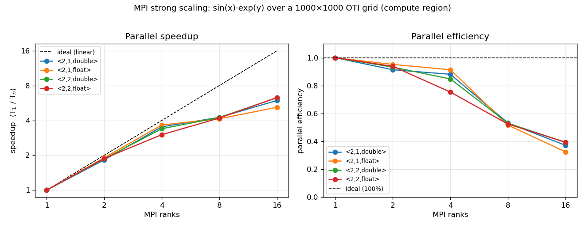

Across CPU Ranks
================

The simplest place to distribute an OTI computation is across **CPU ranks**: each
MPI rank owns a block of the problem, evaluates it on the cores it is bound to,
and the blocks are combined over MPI. This is the execution model behind
:doc:`make_datatype` -- a flat block decomposition of the 1000×1000 grid with no
communication during the compute. The question this page answers is how that
scales as you add ranks.

(The GPU counterpart -- one rank per device -- is :doc:`gpu`; the two are mirror
images of the same idea on different hardware.)

Strong Scaling
--------------

``mpi_oti_scaling`` (in ``mpi_oti_toy/``) times the **compute region** -- each rank
evaluating its block of ``f(x,y) = sin(x)·exp(y)`` -- across rank counts, for all
four study algebras. This is the parallelizable work; the one-time gather is
communication and is discussed separately below, not folded into these curves.
Sweep the rank count and plot:

.. code-block:: console

   cd mpi_oti_toy
   mpicxx -std=c++17 -O2 -I ../include mpi_oti_scaling.cpp -o mpi_oti_scaling
   : > scaling.csv
   for np in 1 2 4 8 16; do
     mpirun -np $np ./mpi_oti_scaling | { [ $np -eq 1 ] && cat || tail -n +2; } >> scaling.csv
   done
   python3 plot_scaling.py scaling.csv scaling.png

Strong scaling (fixed problem size, more ranks) is near-linear to about 4 ranks,
then tapers -- a speedup of roughly 6× at 16 ranks on this 8-core laptop (the
efficiency curve falls from ~95% at 2 ranks to ~40% at 16). Two honest takeaways:

* **The taper is expected.** As ranks rise the per-rank slice shrinks (at 16
  ranks each rank holds only ~62,500 points), so fixed per-iteration overhead and
  memory bandwidth start to dominate, and on a laptop the cores beyond the
  physical count (hyperthreads) add little. This is ordinary strong-scaling /
  Amdahl behavior, not an OTI effect.
* **Heavier jets amortize overhead.** The larger ``<2,2>`` algebras do slightly
  more arithmetic per point, so they hold efficiency marginally better at high
  rank counts than the lightest ``<2,1,float>`` -- more compute per unit of
  overhead.

The Gather Is Communication
---------------------------

The final ``MPI_Gatherv`` is separate from the scaled compute: it moves the whole
result to one rank (for ``<2,2,double>``, 1,000,000 jets × 48 bytes ≈ 48 MB). On a
real solver you would keep data distributed and exchange only what neighbors need
rather than gathering everything -- which is exactly the progression in
:doc:`converting/index`.
