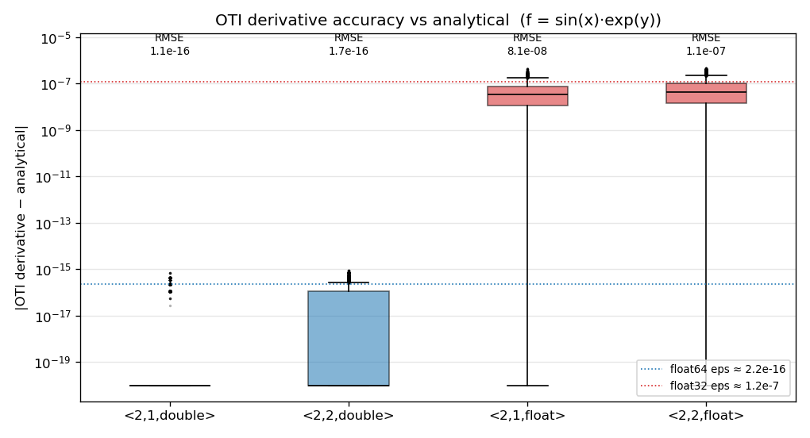

Scaling And Accuracy
====================

Two questions decide whether distributing an OTI computation is worth it: does it
get **faster** with more ranks, and does distributing change the **answer**? This
page measures both for the grid evaluation from :doc:`make_datatype`, over the
four study algebras (``otinum<2,1>`` and ``otinum<2,2>``, each in ``float`` and
``double``). The short version: MPI changes the speed, not the answer.

The two programs (``mpi_oti_scaling.cpp`` and ``verify_derivatives.cpp``) and the
plotters (``plot_scaling.py``, ``plot_accuracy.py``) live in ``mpi_oti_toy/``.

Rank Scaling
------------

``mpi_oti_scaling`` times the **compute region** -- each rank evaluating its block
of the 1000×1000 grid of ``f(x,y) = sin(x)·exp(y)`` -- across rank counts. This is
the parallelizable work; the one-time gather is communication and is measured
separately below, not folded into these curves. Sweep the rank count and plot:

.. code-block:: console

   cd mpi_oti_toy
   mpicxx -std=c++17 -O2 -I ../include mpi_oti_scaling.cpp -o mpi_oti_scaling
   : > scaling.csv
   for np in 1 2 4 8 16; do
     mpirun -np $np ./mpi_oti_scaling | { [ $np -eq 1 ] && cat || tail -n +2; } >> scaling.csv
   done
   python3 plot_scaling.py scaling.csv scaling.png

.. image:: ../../_static/benchmarks/mpi_scaling.png
   :alt: MPI strong-scaling speedup and parallel efficiency vs rank count
   :width: 100%

Strong scaling (fixed problem size, more ranks) is near-linear to about 4 ranks,
then tapers -- a speedup of roughly 6× at 16 ranks on this 8-core laptop (the
efficiency curve falls from ~95% at 2 ranks to ~40% at 16). Two honest takeaways:

* **The taper is expected.** As ranks rise the per-rank slice shrinks (at 16
  ranks each rank holds only ~62,500 points), so fixed per-iteration overhead and
  memory bandwidth start to dominate, and on a laptop the cores beyond the
  physical count (hyperthreads) add little. This is ordinary strong-scaling /
  Amdahl behavior, not an OTI effect.
* **Heavier jets amortize overhead.** The larger ``<2,2>`` algebras do slightly
  more arithmetic per point, so they hold efficiency marginally better at high
  rank counts than the lightest ``<2,1,float>`` -- more compute per unit of
  overhead.

The final ``MPI_Gatherv`` is separate communication: it moves the whole result to
one rank (for ``<2,2,double>``, 1,000,000 jets × 48 bytes ≈ 48 MB), so on a real
solver you would keep data distributed and exchange only halos rather than
gathering everything, which is the subject of later tutorials.

Derivative Accuracy
-------------------

OTI returns **exact** derivatives -- it propagates the chain rule analytically,
not by finite differences -- so the only discrepancy from the closed-form
derivative is floating-point roundoff. ``verify_derivatives`` evaluates
``f = sin(x)·exp(y)`` over the grid, converts each jet's normalized Taylor
coefficients to partial derivatives, and compares against the analytical values
(``f_x = cos(x)e^y``, ``f_xx = -sin(x)e^y``, and so on):

.. code-block:: console

   g++ -std=c++17 -O2 -I ../include verify_derivatives.cpp -o verify_derivatives
   ./verify_derivatives ./deriv
   python3 plot_accuracy.py deriv_errors.csv deriv_rmse.csv accuracy.png

Each box pools the per-point absolute errors of every derivative component for
one algebra. The result is the same story the RMSE makes precise:

.. list-table::
   :header-rows: 1

   * - Algebra
     - RMSE vs analytical
   * - ``otinum<2,1,double>``
     - 1.1e-16
   * - ``otinum<2,2,double>``
     - 1.7e-16
   * - ``otinum<2,1,float>``
     - 8.1e-08
   * - ``otinum<2,2,float>``
     - 1.1e-07

The errors sit right at each type's machine epsilon (``double`` ≈ 2.2e-16,
``float`` ≈ 1.2e-7) -- about nine orders of magnitude apart -- and many ``double``
errors are *exactly* zero. There is no truncation or step-size error to tune, as
there would be with finite differences; the only knob is the coefficient
precision. The derivative order (``<2,1>`` vs ``<2,2>``) does not change the floor,
only which derivatives are available.

.. note::

   This accuracy is a property of the **algebra**, not of the parallelization.
   MPI transfers coefficients bit-for-bit (the round-trip test in
   :doc:`make_datatype` confirms this), so the box plot is identical at one rank
   or a thousand. Distributing the work changes how fast you get the answer, not
   what the answer is.
