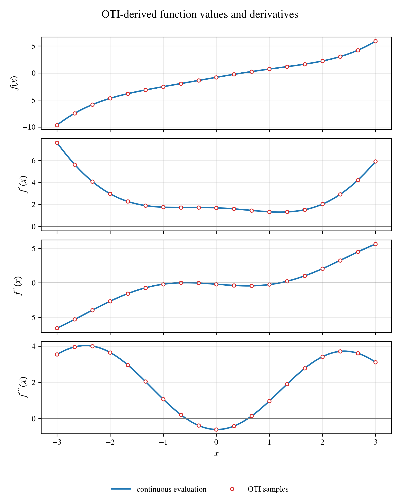

Python Bindings Tutorial
========================

The optional Python module wraps a fixed set of ``oti::otinum<M, N>``
instantiations behind ordinary Python classes. It is useful for
experimentation, validating derivative values against analytic formulas, and
preparing data for plotting — anywhere the convenience of Python outweighs
compiled-code speed.

This tutorial assumes the module is already installed;
:ref:`installation:Python Bindings` covers the editable install and its smoke
tests.

Using The Bound Types
---------------------

Each Python class corresponds to one concrete C++ template instantiation:

.. code-block:: python

   import otinum as oti

   T = oti.OTI_2_3
   x = T.variable(0, 1.5)
   y = T.variable(1, 0.3)
   f = oti.sin(x * y) + oti.exp(x)

   print(f.real())
   print(f.partial([1, 0]))
   print(f.data())

The multi-index arguments passed to ``coeff``, ``partial``, ``set_coeff``, and
``set_partial`` are Python lists or tuples. Their length must match the number
of variables in the bound type. For ``OTI_2_3``, use two entries such as
``[1, 0]``. For ``OTI_3_3``, use three entries such as ``[0, 1, 1]``.

The same methods also accept sparse multi-indices as
``[variable_index, derivative_order]`` pairs:

.. code-block:: python

   T = oti.OTI_3_2
   x0 = T.variable(0, 1.5)
   x2 = T.variable(2, 2.0)
   f = x0 * x2

   print(f.partial([[0, 1]]))          # df/dx0       -> 2.0
   print(f.partial([[2, 1]]))          # df/dx2       -> 1.5
   print(f.partial([[0, 1], [2, 1]]))  # d2f/dx0 dx2  -> 1.0

Variable indices are zero-based, matching ``T.variable(index, value)``. Sparse
pairs with the same variable are added, so ``[[2, 1], [2, 1]]`` requests the
second derivative with respect to variable ``2``. Dense multi-indices remain
the clearest form for small ``M``; the sparse form earns its keep for
high-dimensional types such as a ten-variable ``OTI_10_2``, where a dense
multi-index would be a ten-entry list. Shapes that large are not bound by
default — add them with the instantiation steps below.

What The Module Exposes
-----------------------

The bound types mirror the C++ surface:

* Arithmetic operators between OTI values and with Python floats, plus
  ``**`` for powers.
* Comparison operators. Like the C++ operators, these compare **only the real
  coefficient**, so OTI values behave like their real parts in ``if``
  statements and ``sorted`` — two values with equal real parts compare equal
  even when their derivative coefficients differ.
* The elementary functions as module-level calls (``oti.sin``, ``oti.exp``,
  ``oti.atan2``, ...), including the ``cmath``-style surface: rounding
  (``floor``, ``ceil``, ``round``, ``trunc``), predicates (``isnan``,
  ``isinf``, ``isfinite``, ``signbit``), and two-argument helpers (``hypot``,
  ``copysign``, ``fmod``, ``fmin``/``fmax``).
* The fused helpers ``oti.scale_add(a, s, b)`` (returns ``a + s*b``) and the
  in-place ``oti.axpy(y, s, x)`` / ``oti.fma_into(y, a, b)``, which modify
  ``y`` directly. In compiled code these exist to eliminate temporaries; in
  Python they are bound for API parity with C++ kernels you may be
  prototyping.
* Sequence behavior: ``len(value)`` is ``ncoeffs`` and ``value[k]`` reads or
  writes one flat coefficient.

Currently Bound Instantiations
------------------------------

The binding file registers this small grid by default:

.. code-block:: text

   OTI_1_1  OTI_1_2  OTI_1_3
   OTI_2_1  OTI_2_2  OTI_2_3
   OTI_3_1  OTI_3_2  OTI_3_3

Python cannot instantiate arbitrary C++ templates at runtime. A type such as
``oti::otinum<10, 1>`` must be explicitly compiled into the extension before it
can be imported as a Python class.

Adding A New Instantiation
--------------------------

To add ``OTI_10_1``, edit ``bindings/python/otinum_py.cpp``. At the bottom of
the file, inside ``PYBIND11_MODULE(otinum, m)``, add:

.. code-block:: cpp

   bind_otinum<10, 1>(m, "OTI_10_1");

The registration block would then include:

.. code-block:: cpp

   PYBIND11_MODULE(otinum, m)
   {
       m.doc() = "Python bindings for static OTI numbers";

       bind_otinum<1, 1>(m, "OTI_1_1");
       bind_otinum<1, 2>(m, "OTI_1_2");
       bind_otinum<1, 3>(m, "OTI_1_3");

       // ...

       bind_otinum<10, 1>(m, "OTI_10_1");
   }

Rebuild the editable install after changing the bindings:

.. code-block:: console

   python -m pip install -e . --force-reinstall

Then test the new type:

.. code-block:: console

   python -c "import otinum as oti; print(oti.OTI_10_1.nvars, oti.OTI_10_1.order, oti.OTI_10_1.ncoeffs)"

For ``OTI_10_1``, ``ncoeffs`` is ``11`` because the type stores the real
coefficient plus one first-order coefficient for each of the ten variables.

Practical Notes
---------------

Adding more instantiations increases compile time and extension size because
each ``otinum<M, N>`` type is a distinct C++ template instantiation. Prefer
binding the shapes you actually use rather than a very large grid. Large
``M``/``N`` combinations can also create many coefficients per value, so check
``T.ncoeffs`` before adding broad Python coverage.

Plotting With Matplotlib
------------------------

The core C++ library does not depend on a plotting package; the clean workflow
for figures is to compute values through these bindings and render them with
Matplotlib. The general pattern is to evaluate OTI values over a grid of input
points, collect real and derivative values into arrays, and plot the arrays:

.. code-block:: python

   import matplotlib.pyplot as plt
   import numpy as np
   import otinum as oti

   T = oti.OTI_1_3
   xs = np.linspace(-2.0, 2.0, 200)
   values = []
   derivatives = []

   for point in xs:
       x = T.variable(0, float(point))
       y = oti.sin(x) + x * x
       values.append(y.real())
       derivatives.append(y.partial([1]))

   plt.plot(xs, values, label="f(x)")
   plt.plot(xs, derivatives, label="df/dx")
   plt.legend()
   plt.tight_layout()
   plt.savefig("tutorial_plot.png", dpi=160)

The repository contains ready-made examples of this pattern that generate the
figures under ``examples/python/figures``. Install the binding and plotting
dependencies together with the ``examples`` extra, then run the scripts from
the repository root:

.. code-block:: console

   python -m pip install -e ".[examples]"
   python examples/python/one_dimensional.py
   python examples/python/two_dimensional.py
   python examples/python/three_dimensional.py
   python examples/python/1d_newton_raphson.py

